# Building Production AI Agents: From Chatbot to Intelligent Systems

## Table of Contents
1. [Introduction: What is an AI Agent?](#introduction)
2. [The Evolution: From Chatbot to Agent](#evolution)
3. [Core Components of an AI Agent](#core-components)
4. [Building Block 1: State Management](#state-management)
5. [Building Block 2: Decision Making](#decision-making)
6. [Building Block 3: Tool Integration](#tool-integration)
7. [Building Block 4: Memory Systems](#memory-systems)
8. [Building Block 5: Human-in-the-Loop](#human-in-the-loop)
9. [Building Block 6: Evaluation & Monitoring](#evaluation)
10. [Production Considerations](#production)
11. [Case Study: Building a Customer Support Agent](#case-study)
12. [Best Practices & Pitfalls](#best-practices)

---

## 1. Introduction: What is an AI Agent? {#introduction}

An AI agent is an autonomous system that can:
- **Perceive** its environment (through inputs, tools, and memory)
- **Reason** about what actions to take (using LLMs and decision logic)
- **Act** to achieve specific goals (through tools and outputs)
- **Learn** from interactions (via memory and feedback)


### Key Differences from Chatbots

| Aspect | Chatbot | AI Agent |
|--------|---------|----------|
| **State** | Stateless conversation | Maintains complex state |
| **Actions** | Text generation only | Can use tools and APIs |
| **Memory** | Short conversation history | Long-term memory + learning |
| **Decision** | Single LLM call | Multi-step reasoning |
| **Goals** | Answer questions | Complete complex tasks |

---

## 2. The Evolution: From Chatbot to Agent {#evolution}

Let's trace the evolution with a concrete example: a technical support system.


---

## 3. Core Components of an AI Agent {#core-components}

Every production AI agent needs these essential components:


### Component Responsibilities

1. **State Management**: Tracks conversation context, user info, task progress
2. **Decision Router**: Determines which actions to take based on state
3. **Tool Executor**: Interfaces with external systems and APIs
4. **Memory System**: Stores and retrieves relevant past interactions
5. **Evaluator**: Assesses quality and decides if human review is needed
6. **Supporting Systems**: Ensure production readiness

---

## 4. Building Block 1: State Management {#state-management}

State is the foundation of any agent. It's what transforms a stateless LLM into a stateful agent.

### State Design Principles


### Example: Customer Support Agent State

```python
from pydantic import BaseModel, Field
from typing import List, Optional, Dict, Any
from datetime import datetime

class CustomerSupportState(BaseModel):
    """Complete state for customer support agent"""
    
    # Conversation Context
    conversation_id: str
    customer_id: str
    messages: List[Dict[str, str]] = Field(default_factory=list)
    
    # Current Issue
    issue_type: Optional[str] = None
    severity: Optional[str] = None
    affected_services: List[str] = Field(default_factory=list)
    
    # Actions Taken
    tools_used: List[str] = Field(default_factory=list)
    diagnostics_run: List[Dict[str, Any]] = Field(default_factory=list)
    solutions_attempted: List[str] = Field(default_factory=list)
    
    # Resolution Status
    issue_resolved: bool = False
    resolution_summary: Optional[str] = None
    follow_up_needed: bool = False
    
    # Metadata
    started_at: datetime = Field(default_factory=datetime.now)
    last_updated: datetime = Field(default_factory=datetime.now)
    escalated_to_human: bool = False
```

### State Management Patterns


---

## 5. Building Block 2: Decision Making {#decision-making}

Decision making is where agents become intelligent. This involves routing, planning, and orchestration.

### Decision Architecture


### Example: Multi-Expert Router

```python
class ExpertRouter:
    """Routes requests to specialized experts"""
    
    def route(self, state: CustomerSupportState) -> str:
        """Determine which expert should handle this issue"""
        
        # Rule-based routing for clear cases
        if "login" in state.issue_type.lower():
            return "authentication_expert"
        elif "payment" in state.issue_type.lower():
            return "billing_expert"
        elif "performance" in state.issue_type.lower():
            return "infrastructure_expert"
        
        # LLM-based routing for complex cases
        routing_prompt = f"""
        Based on the following customer issue, determine the best expert:
        
        Issue: {state.messages[-1]['content']}
        Previous actions: {state.solutions_attempted}
        
        Available experts:
        - authentication_expert: Login, passwords, 2FA
        - billing_expert: Payments, subscriptions, refunds
        - infrastructure_expert: Performance, uptime, scaling
        - general_expert: Everything else
        
        Return only the expert name.
        """
        
        expert = self.llm.invoke(routing_prompt)
        return expert.content.strip()
```

### Decision Patterns


---

## 6. Building Block 3: Tool Integration {#tool-integration}

Tools transform agents from advisors to actors. They enable agents to interact with the real world.

### Tool Architecture


### Example: Production Tool Set

```python
from langchain.tools import tool
from typing import Dict, Any
import asyncio

class ProductionTools:
    """Production-ready tool implementations"""
    
    @tool
    async def check_system_status(self, service_name: str) -> Dict[str, Any]:
        """Check the health status of a service
        
        Args:
            service_name: Name of the service to check
            
        Returns:
            Dict containing status, metrics, and recent errors
        """
        # In production, this would call monitoring APIs
        return {
            "service": service_name,
            "status": "healthy",
            "uptime": "99.9%",
            "response_time": "45ms",
            "recent_errors": []
        }
    
    @tool
    async def restart_service(self, service_name: str, reason: str) -> Dict[str, Any]:
        """Restart a service with audit logging
        
        Args:
            service_name: Name of the service to restart
            reason: Reason for restart (for audit trail)
            
        Returns:
            Dict with restart status and new instance ID
        """
        # Production implementation would:
        # 1. Validate permissions
        # 2. Check dependencies
        # 3. Graceful shutdown
        # 4. Start new instance
        # 5. Health check
        # 6. Update load balancer
        
        await self.audit_log("service_restart", {
            "service": service_name,
            "reason": reason,
            "initiated_by": "ai_agent"
        })
        
        return {
            "status": "success",
            "old_instance": "i-12345",
            "new_instance": "i-67890",
            "downtime": "0s"  # Rolling restart
        }
    
    @tool
    def search_knowledge_base(self, query: str, filters: Dict = None) -> List[Dict]:
        """Search internal knowledge base with semantic search
        
        Args:
            query: Search query
            filters: Optional filters (category, date_range, etc)
            
        Returns:
            List of relevant documents with metadata
        """
        # Production features:
        # - Semantic search with embeddings
        # - Result ranking
        # - Access control
        # - Usage analytics
        
        results = self.vector_db.search(
            query=query,
            filters=filters,
            limit=5,
            include_metadata=True
        )
        
        return [
            {
                "title": doc.title,
                "content": doc.content,
                "relevance": doc.score,
                "last_updated": doc.updated_at,
                "access_level": doc.access_level
            }
            for doc in results
        ]
```

### Tool Safety Patterns


---

## 7. Building Block 4: Memory Systems {#memory-systems}

Memory transforms agents from reactive to proactive systems that learn and improve.

### Memory Architecture


### Example: Intelligent Memory System

```python
class AgentMemory:
    """Production memory system for agents"""
    
    def __init__(self):
        self.redis_client = Redis()
        self.postgres = PostgresDB()
        self.vector_store = Pinecone()
        
    async def remember_interaction(self, state: CustomerSupportState):
        """Store interaction with intelligent indexing"""
        
        # 1. Extract key information
        entities = self.extract_entities(state)
        summary = self.summarize_interaction(state)
        embedding = self.create_embedding(summary)
        
        # 2. Store in appropriate layers
        # Short-term: Current conversation
        await self.redis_client.setex(
            f"conversation:{state.conversation_id}",
            ttl=3600,  # 1 hour
            value=state.json()
        )
        
        # Long-term: Customer history
        await self.postgres.insert(
            "customer_interactions",
            {
                "customer_id": state.customer_id,
                "issue_type": state.issue_type,
                "resolution": state.resolution_summary,
                "satisfaction": state.customer_satisfaction,
                "created_at": state.started_at
            }
        )
        
        # Semantic: For similarity search
        await self.vector_store.upsert(
            id=state.conversation_id,
            embedding=embedding,
            metadata={
                "customer_id": state.customer_id,
                "issue_type": state.issue_type,
                "resolved": state.issue_resolved,
                "entities": entities
            }
        )
    
    async def recall_similar_issues(self, current_issue: str, limit: int = 5):
        """Find similar past issues and their resolutions"""
        
        # Semantic search for similar issues
        embedding = self.create_embedding(current_issue)
        similar = await self.vector_store.search(
            embedding=embedding,
            filter={"resolved": True},
            limit=limit
        )
        
        # Enrich with full context
        enriched_results = []
        for match in similar:
            full_data = await self.postgres.get(
                "customer_interactions",
                match.metadata["conversation_id"]
            )
            enriched_results.append({
                "similarity": match.score,
                "issue": full_data["issue_description"],
                "resolution": full_data["resolution"],
                "time_to_resolve": full_data["resolution_time"]
            })
            
        return enriched_results
    
    async def identify_patterns(self, customer_id: str):
        """Identify patterns in customer issues"""
        
        # Get customer history
        history = await self.postgres.query(
            """
            SELECT issue_type, COUNT(*) as frequency,
                   AVG(resolution_time) as avg_time
            FROM customer_interactions
            WHERE customer_id = %s
            GROUP BY issue_type
            ORDER BY frequency DESC
            """,
            [customer_id]
        )
        
        # Identify recurring issues
        patterns = {
            "recurring_issues": [
                h for h in history if h["frequency"] > 2
            ],
            "average_resolution_time": sum(h["avg_time"] for h in history) / len(history),
            "escalation_rate": self.calculate_escalation_rate(customer_id)
        }
        
        return patterns
```

### Memory Patterns


---

## 8. Building Block 5: Human-in-the-Loop {#human-in-the-loop}

Human-in-the-loop (HITL) ensures safety, quality, and continuous improvement.

### HITL Architecture


### Example: HITL Implementation

```python
class HumanInTheLoop:
    """Production HITL system"""
    
    def __init__(self):
        self.queue = ReviewQueue()
        self.notification = NotificationService()
        
    async def check_escalation(self, state: AgentState) -> bool:
        """Determine if human review is needed"""
        
        escalation_rules = [
            # Low confidence
            state.confidence < 0.7,
            
            # Sensitive actions
            any(tool in state.tools_used for tool in [
                "delete_customer_data",
                "process_refund",
                "modify_production_config"
            ]),
            
            # Customer request
            "speak to human" in state.last_message.lower(),
            
            # Policy requirements
            state.total_cost > 1000,  # High value transactions
            state.customer_tier == "enterprise",  # VIP customers
            
            # Pattern detection
            state.failed_attempts > 2,  # Multiple failures
        ]
        
        return any(escalation_rules)
    
    async def escalate_to_human(self, state: AgentState) -> Dict[str, Any]:
        """Escalate to human review"""
        
        # 1. Create review package
        review_package = {
            "id": str(uuid.uuid4()),
            "state": state.dict(),
            "context": await self.build_context(state),
            "suggested_actions": await self.suggest_actions(state),
            "priority": self.calculate_priority(state),
            "created_at": datetime.now()
        }
        
        # 2. Add to queue
        await self.queue.add(review_package)
        
        # 3. Notify appropriate team
        await self.notification.notify(
            team=self.route_to_team(state),
            priority=review_package["priority"],
            summary=self.summarize_issue(state)
        )
        
        # 4. Wait for human input (with timeout)
        human_input = await self.wait_for_human(
            review_id=review_package["id"],
            timeout=300  # 5 minutes
        )
        
        if human_input:
            return {
                "action": human_input["action"],
                "reasoning": human_input["reasoning"],
                "feedback": human_input["feedback"]
            }
        else:
            # Timeout - fall back to safe default
            return {
                "action": "escalate_to_tier2",
                "reasoning": "No response from tier 1 support",
                "feedback": None
            }
    
    async def learn_from_feedback(self, state: AgentState, human_input: Dict):
        """Learn from human decisions"""
        
        # Store decision for future learning
        await self.store_feedback({
            "state": state.dict(),
            "agent_suggestion": state.suggested_action,
            "human_decision": human_input["action"],
            "human_reasoning": human_input["reasoning"],
            "outcome": await self.track_outcome(state.conversation_id)
        })
        
        # Update model if pattern emerges
        if await self.detect_pattern():
            await self.trigger_model_update()
```

### HITL Patterns


---

## 9. Building Block 6: Evaluation & Monitoring {#evaluation}

Evaluation ensures agents perform correctly and improve over time.

### Evaluation Framework


### Example: Production Evaluation System

```python
class AgentEvaluator:
    """Comprehensive evaluation system for production agents"""
    
    def __init__(self):
        self.metrics_store = MetricsDB()
        self.quality_checker = QualityAssurance()
        self.ml_evaluator = MLEvaluator()
        
    async def evaluate_interaction(self, state: AgentState) -> EvaluationResult:
        """Evaluate a complete interaction"""
        
        metrics = {}
        
        # 1. Performance Metrics
        metrics["response_time"] = state.total_duration
        metrics["tokens_used"] = state.total_tokens
        metrics["tools_called"] = len(state.tools_used)
        metrics["turns_to_resolution"] = len(state.messages) // 2
        
        # 2. Quality Metrics
        metrics["resolution_success"] = state.issue_resolved
        metrics["customer_satisfaction"] = await self.get_csat(state.conversation_id)
        metrics["escalation_needed"] = state.escalated_to_human
        
        # 3. Safety Checks
        safety_check = await self.quality_checker.check_safety({
            "responses": [m for m in state.messages if m["role"] == "assistant"],
            "actions": state.tools_used,
            "data_accessed": state.data_accessed
        })
        metrics["safety_score"] = safety_check.score
        metrics["safety_violations"] = safety_check.violations
        
        # 4. Accuracy Evaluation (if ground truth available)
        if state.has_ground_truth:
            accuracy = await self.ml_evaluator.evaluate_accuracy(
                predicted=state.resolution_summary,
                actual=state.ground_truth,
                method="semantic_similarity"
            )
            metrics["accuracy"] = accuracy
        
        # 5. Cost Analysis
        metrics["cost"] = self.calculate_cost(state)
        metrics["cost_per_resolution"] = (
            metrics["cost"] / 1 if state.issue_resolved else float('inf')
        )
        
        # 6. Store metrics
        await self.metrics_store.store(
            conversation_id=state.conversation_id,
            metrics=metrics,
            metadata={
                "agent_version": state.agent_version,
                "customer_tier": state.customer_tier,
                "issue_type": state.issue_type
            }
        )
        
        return EvaluationResult(
            metrics=metrics,
            recommendations=self.generate_recommendations(metrics)
        )
    
    async def continuous_monitoring(self):
        """Real-time monitoring with alerts"""
        
        while True:
            # Get recent metrics
            recent_metrics = await self.metrics_store.get_recent(minutes=5)
            
            # Check for anomalies
            anomalies = await self.detect_anomalies(recent_metrics)
            
            if anomalies:
                await self.alert_team(anomalies)
            
            # Check SLA compliance
            sla_violations = self.check_sla(recent_metrics)
            if sla_violations:
                await self.escalate_sla_violation(sla_violations)
            
            await asyncio.sleep(60)  # Check every minute
    
    def detect_anomalies(self, metrics: List[Dict]) -> List[Anomaly]:
        """Detect unusual patterns in metrics"""
        
        anomalies = []
        
        # Response time spike
        avg_response = np.mean([m["response_time"] for m in metrics])
        if avg_response > self.baseline_response_time * 2:
            anomalies.append(Anomaly(
                type="performance",
                severity="high",
                description=f"Response time 2x normal: {avg_response}s"
            ))
        
        # Accuracy drop
        if "accuracy" in metrics[0]:
            recent_accuracy = np.mean([m["accuracy"] for m in metrics[-10:]])
            if recent_accuracy < self.accuracy_threshold:
                anomalies.append(Anomaly(
                    type="quality",
                    severity="critical",
                    description=f"Accuracy below threshold: {recent_accuracy}"
                ))
        
        # Cost spike
        recent_cost = sum(m["cost"] for m in metrics)
        if recent_cost > self.cost_budget_hourly:
            anomalies.append(Anomaly(
                type="cost",
                severity="medium",
                description=f"Hourly cost exceeds budget: ${recent_cost}"
            ))
        
        return anomalies
```

### Evaluation Dashboard

```mermaid
graph TB
    subgraph "Agent Performance Dashboard"
        subgraph "Real-time Metrics"
            Active[Active Conversations: 247]
            RPS[Requests/sec: 12.4]
            Latency[Avg Latency: 1.2s]
            Success[Success Rate: 94.2%]
        end
        
        subgraph "Quality Indicators"
            CSAT[CSAT Score: 4.6/5]
            Escalation[Escalation Rate: 8.3%]
            Resolution[First Contact Resolution: 76%]
        end
        
        subgraph "Cost & Efficiency"
            TokenCost[Token Cost/hour: $124]
            CostPerTicket[Cost/ticket: $0.43]
            AutomationRate[Automation Rate: 91.7%]
        end
        
        subgraph "Alerts & Issues"
            Alert1[🔴 High latency on billing agent]
            Alert2[🟡 Approaching token budget]
            Alert3[🟢 All systems operational]
        end
    end
```



---

## 10. Production Considerations {#production}

Moving from prototype to production requires addressing scale, reliability, and safety.

### Production Architecture


### Production Checklist

```python
class ProductionReadiness:
    """Checklist for production deployment"""
    
    @staticmethod
    def security_checklist():
        return {
            "authentication": [
                "API key management",
                "OAuth2 implementation",
                "Rate limiting per user",
                "IP allowlisting"
            ],
            "data_protection": [
                "Encryption at rest",
                "Encryption in transit",
                "PII detection and masking",
                "GDPR compliance"
            ],
            "access_control": [
                "Role-based permissions",
                "Tool execution limits",
                "Data access boundaries",
                "Audit logging"
            ]
        }
    
    @staticmethod
    def reliability_checklist():
        return {
            "high_availability": [
                "Multi-region deployment",
                "Automatic failover",
                "Health checks",
                "Circuit breakers"
            ],
            "error_handling": [
                "Graceful degradation",
                "Retry with backoff",
                "Dead letter queues",
                "Error tracking"
            ],
            "performance": [
                "Response time SLA",
                "Concurrent request handling",
                "Caching strategy",
                "Database optimization"
            ]
        }
    
    @staticmethod
    def observability_checklist():
        return {
            "logging": [
                "Structured logging",
                "Centralized log aggregation",
                "Log retention policy",
                "Sensitive data filtering"
            ],
            "monitoring": [
                "Business metrics",
                "Technical metrics",
                "Custom dashboards",
                "Alert configuration"
            ],
            "tracing": [
                "Distributed tracing",
                "Request correlation",
                "Performance profiling",
                "Dependency mapping"
            ]
        }
```

---

## 11. Case Study: Building a Customer Support Agent {#case-study}

Let's build a complete customer support agent step by step.

### Step 1: Define the Agent's Capabilities


### Step 2: Implementation

```python
class CustomerSupportAgent:
    """Production customer support agent"""
    
    def __init__(self):
        self.llm = LLMFactory.create()
        self.router = ExpertRouter()
        self.tools = ProductionTools()
        self.memory = AgentMemory()
        self.evaluator = AgentEvaluator()
        self.hitl = HumanInTheLoop()
        
    async def handle_request(self, request: CustomerRequest) -> Resolution:
        """Main entry point for customer requests"""
        
        # 1. Initialize state
        state = CustomerSupportState(
            conversation_id=str(uuid.uuid4()),
            customer_id=request.customer_id,
            messages=[{"role": "user", "content": request.message}]
        )
        
        # 2. Retrieve context from memory
        context = await self.memory.recall_similar_issues(request.message)
        customer_history = await self.memory.get_customer_history(request.customer_id)
        
        # 3. Route to appropriate expert
        expert_type = self.router.route(state)
        expert = self.get_expert(expert_type)
        
        # 4. Generate initial response
        response = await expert.analyze(state, context)
        state.messages.append({"role": "assistant", "content": response.message})
        
        # 5. Execute diagnostic tools if needed
        if response.requires_diagnostics:
            diagnostics = await self.run_diagnostics(response.diagnostic_plan)
            state.diagnostics_run.append(diagnostics)
            
        # 6. Attempt resolution
        resolution = await expert.resolve(state)
        
        # 7. Check if escalation needed
        if await self.hitl.check_escalation(state):
            human_input = await self.hitl.escalate_to_human(state)
            resolution = self.apply_human_input(resolution, human_input)
        
        # 8. Store interaction
        await self.memory.remember_interaction(state)
        
        # 9. Evaluate quality
        evaluation = await self.evaluator.evaluate_interaction(state)
        
        # 10. Return resolution
        return Resolution(
            success=resolution.success,
            message=resolution.message,
            actions_taken=resolution.actions,
            follow_up_needed=resolution.follow_up,
            quality_score=evaluation.metrics["quality_score"]
        )
```

### Step 3: Deployment Pipeline


---

## 12. Best Practices & Pitfalls {#best-practices}

### Best Practices

1. **Start Simple, Iterate Fast**
   - Begin with rule-based routing
   - Add LLM reasoning gradually
   - Validate each component independently

2. **Design for Failure**
   - Every external call can fail
   - Have fallback options
   - Graceful degradation over hard failures

3. **Human-Centric Design**
   - Make escalation seamless
   - Provide clear context for reviewers
   - Learn from every human intervention

4. **Measure Everything**
   - Business metrics (resolution rate, CSAT)
   - Technical metrics (latency, errors)
   - Cost metrics (tokens, API calls)

5. **Security First**
   - Principle of least privilege
   - Audit everything
   - Regular security reviews

### Common Pitfalls


### Architecture Decision Record (ADR)

```python
class ArchitectureDecisions:
    """Key decisions for production agents"""
    
    decisions = {
        "state_management": {
            "choice": "Pydantic + Redis",
            "alternatives": ["TypedDict", "Dataclasses"],
            "reasoning": "Type safety + Serialization + Performance"
        },
        "llm_framework": {
            "choice": "LangGraph",
            "alternatives": ["LangChain", "Custom"],
            "reasoning": "Built-in state management + Production features"
        },
        "memory_store": {
            "choice": "PostgreSQL + Pinecone",
            "alternatives": ["MongoDB", "Elasticsearch"],
            "reasoning": "ACID compliance + Vector search capabilities"
        },
        "deployment": {
            "choice": "Kubernetes + ArgoCD",
            "alternatives": ["ECS", "Cloud Run"],
            "reasoning": "Flexibility + GitOps + Multi-cloud"
        }
    }
```

---

## Conclusion

Building production AI agents is a journey from simple chatbots to complex, autonomous systems. The key is to:

1. **Start with clear goals** - What problem are you solving?
2. **Build incrementally** - Add complexity as needed
3. **Measure constantly** - You can't improve what you don't measure
4. **Stay human-centric** - AI assists, humans decide
5. **Plan for scale** - Design for 10x growth

Remember: The best agent is not the most complex one, but the one that reliably solves real problems for real users.

### Next Steps

1. **Prototype** - Build a simple agent for your use case
2. **Validate** - Test with real users in controlled environment
3. **Iterate** - Improve based on feedback
4. **Scale** - Address production concerns
5. **Monitor** - Continuously improve

The future of AI is not just about powerful models, but about building reliable, safe, and useful agents that augment human capabilities. Start building yours today!