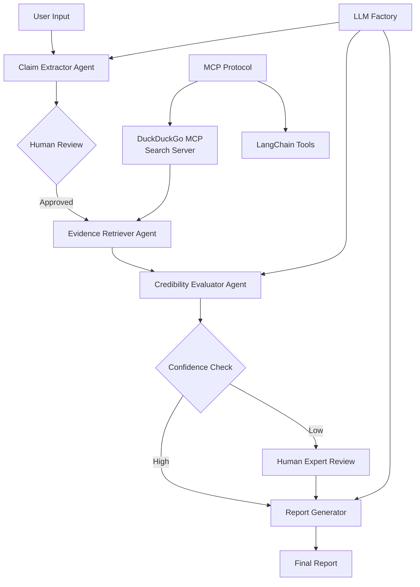
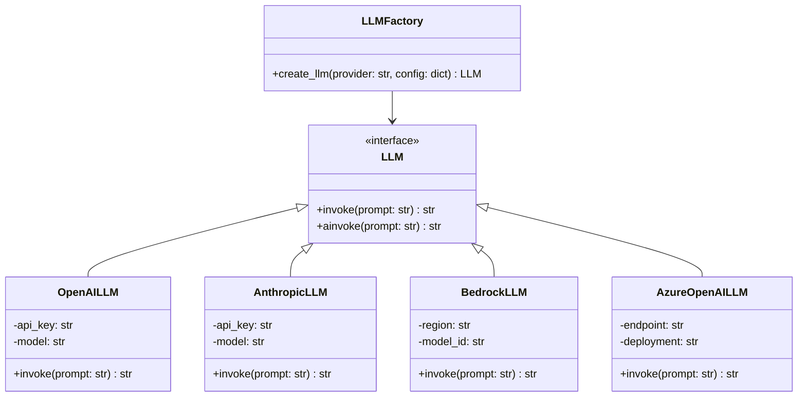
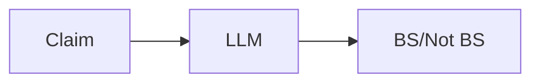
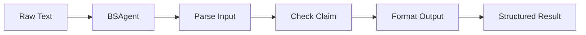
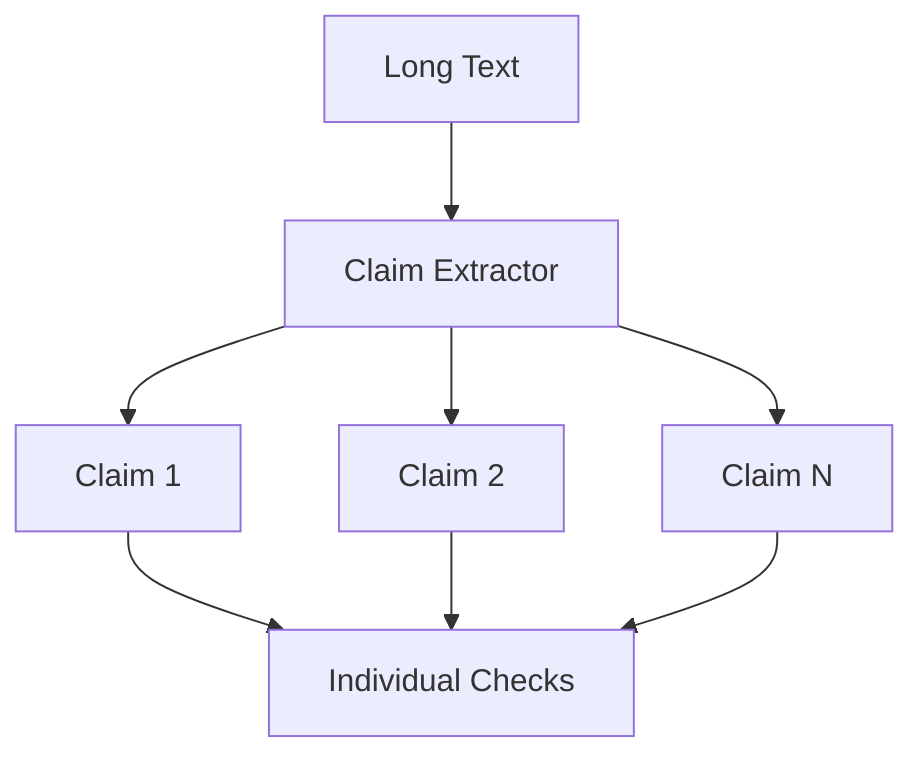
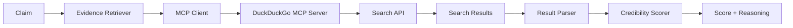
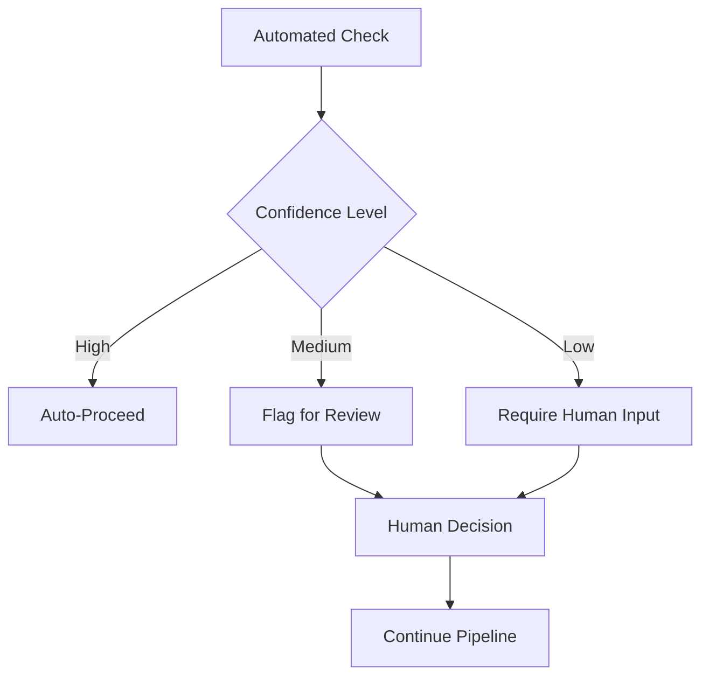
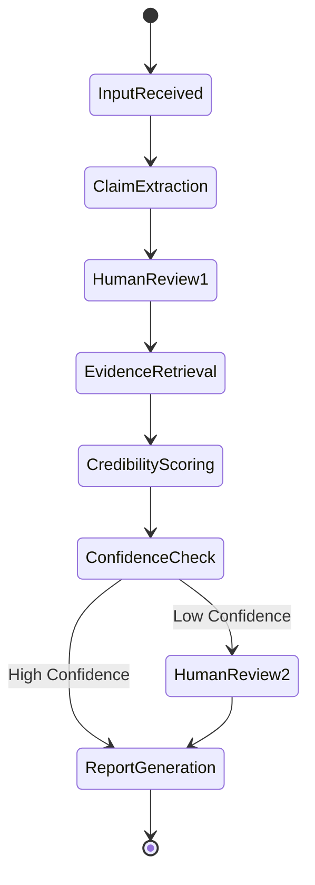

# AI Agents Workshop: "Is This Going to Fly?" BS-Detector

## What We're Building

### The Problem
In today's world, we're bombarded with claims, statistics, and "facts" - especially about technical topics. How do we quickly assess if a claim is credible? We'll build an AI-powered BS detector with an aviation theme ("Will this claim fly?").

### The Solution
A multi-agent system that:
1. **Extracts** individual claims from text
2. **Searches** for relevant evidence using online tools
3. **Evaluates** credibility with confidence scores
4. **Synthesizes** findings into a human-readable report
5. **Includes** human checkpoints for critical decisions

### System Architecture



## Environment Setup

### Supported Platforms
- **Local Development**: Jupyter Lab/Notebook
- **Google Colab**: Cloud-based notebooks
- **AWS SageMaker**: Enterprise ML platform

### LLM Factory Pattern

We'll implement a factory pattern to support multiple LLM providers:



## Workshop Structure: Building Incrementally

### Module 0: Environment & LLM Setup (10 min)
**What we build**: Configuration system and LLM factory
**Why**: Ensure everyone can run the code regardless of their LLM provider

```python
# config.py
class LLMFactory:
    @staticmethod
    def create_llm(provider="openai", **kwargs):
        # Factory implementation
        pass
```

### Module 1: Simple BS Detector (15 min)
**What we build**: Basic claim checker with single LLM call
**Why**: Establish baseline and understand limitations



### Module 2: Structured Agent (15 min)
**What we build**: Agent class with structured inputs/outputs
**Why**: Better control and consistency



### Module 3: Multi-Claim Extraction (15 min)
**What we build**: Tool to extract and process multiple claims
**Why**: Real text contains multiple assertions



### Module 4: Evidence-Based Checking (20 min)
**What we build**: Online search tools and evidence scoring
**Why**: Real-time information improves accuracy



### Module 5: Human-in-the-Loop (15 min)
**What we build**: Checkpoints for human review
**Why**: Critical decisions need human oversight



### Module 6: Full Orchestration (20 min)
**What we build**: Complete multi-agent pipeline with LangGraph
**Why**: Production-ready system with state management



## Project Structure (Final)

Based on our incremental approach, here's the recommended structure:

```
is_this_going_to_fly/
├── config/
│   ├── __init__.py
│   ├── llm_factory.py        # LLM provider abstraction
│   └── settings.py           # Environment configuration
├── tools/
│   ├── __init__.py
│   ├── mcp_tools.py          # MCP client wrapper for DuckDuckGo
│   └── tool_registry.py      # Tool management system
├── modules/
│   ├── __init__.py
│   ├── m0_setup.py          # Environment & LLM setup
│   ├── m1_baseline.py       # Simple BS detector
│   ├── m2_agent.py          # Structured agent
│   ├── m3_extractor.py      # Multi-claim extraction
│   ├── m4_evidence.py       # Evidence search via MCP
│   ├── m5_human_loop.py     # Human-in-the-loop
│   └── m6_orchestrator.py   # Full pipeline
├── notebooks/
│   ├── 00_Setup.ipynb       # Environment & MCP verification
│   ├── 01_Baseline.ipynb    # Simple BS detector
│   ├── 02_Agent.ipynb       # Structured agent
│   ├── 03_Extractor.ipynb   # Claim extraction
│   ├── 04_Evidence.ipynb    # DuckDuckGo MCP integration
│   ├── 05_HumanLoop.ipynb   # Human checkpoints
│   └── 06_Pipeline.ipynb    # Complete system
├── utils/
│   ├── __init__.py
│   ├── prompts.py           # Prompt templates
│   └── visualization.py     # Mermaid diagram helpers
├── mcp_config.json          # MCP server configuration
├── requirements.txt
├── setup.py
└── README.md
```

## Installation & Setup

### Requirements
```txt
# Core dependencies
langchain>=0.1.0
langchain-community>=0.1.0
langgraph>=0.0.20
langchain-openai>=0.0.5
langchain-anthropic>=0.1.1
langchain-aws>=0.1.0

# MCP integration
mcp>=0.1.0
httpx>=0.25.0

# Evaluation
deepeval>=0.21.0
pytest>=7.0.0

# Notebook support
jupyter>=1.0.0
ipywidgets>=8.0.0
mermaid-py>=0.2.0

# Utilities
python-dotenv>=1.0.0
pydantic>=2.0.0
aiohttp>=3.9.0
pandas>=2.0.0
```

### MCP Server Setup

#### Installing DuckDuckGo MCP Server
```bash
# Install the DuckDuckGo MCP server
npx @modelcontextprotocol/create-server duckduckgo-mcp

# Or using npm globally
npm install -g @duckduckgo/mcp-server
```

#### MCP Configuration (mcp_config.json)
```json
{
  "servers": {
    "duckduckgo": {
      "command": "npx",
      "args": ["@duckduckgo/mcp-server"],
      "env": {}
    }
  }
}
```

### Environment Variables
```bash
# .env file
LLM_PROVIDER=openai  # or anthropic, bedrock, azure
OPENAI_API_KEY=sk-...
ANTHROPIC_API_KEY=sk-ant-...
AWS_REGION=us-east-1
AZURE_OPENAI_ENDPOINT=https://...
AZURE_OPENAI_API_KEY=...
```

## Code Examples

### Module 0: LLM Factory Implementation
```python
# config/llm_factory.py
from abc import ABC, abstractmethod
from typing import Optional, Dict, Any
from langchain_openai import ChatOpenAI
from langchain_anthropic import ChatAnthropic
from langchain_aws import ChatBedrock
from langchain_openai import AzureChatOpenAI

class LLMFactory:
    @staticmethod
    def create_llm(
        provider: str = "openai",
        model: Optional[str] = None,
        **kwargs
    ) -> Any:
        providers = {
            "openai": LLMFactory._create_openai,
            "anthropic": LLMFactory._create_anthropic,
            "bedrock": LLMFactory._create_bedrock,
            "azure": LLMFactory._create_azure
        }
        
        if provider not in providers:
            raise ValueError(f"Unknown provider: {provider}")
            
        return providers[provider](model, **kwargs)
    
    @staticmethod
    def _create_openai(model: Optional[str], **kwargs):
        return ChatOpenAI(
            model=model or "gpt-4",
            temperature=kwargs.get("temperature", 0.7)
        )
    
    # Additional provider methods...
```

### Module 1: Baseline BS Detector
```python
# modules/m1_baseline.py
def check_claim(claim: str, llm) -> Dict[str, Any]:
    """Simple BS detection with single LLM call"""
    prompt = f"""
    Analyze this aviation claim and determine if it's BS or legitimate:
    Claim: {claim}
    
    Respond with:
    - Verdict: BS or LEGITIMATE
    - Confidence: 0-100%
    - Reasoning: Brief explanation
    """
    
    response = llm.invoke(prompt)
    # Parse and return structured response
    return parse_response(response)
```

### Module 4: MCP Integration for Evidence Search
```python
# tools/mcp_tools.py
from mcp import Client
from langchain.tools import Tool
import asyncio

class DuckDuckGoMCPTool:
    def __init__(self, mcp_config_path: str = "mcp_config.json"):
        self.client = Client()
        self.mcp_config = mcp_config_path
        
    async def search(self, query: str) -> List[Dict[str, Any]]:
        """Search using DuckDuckGo MCP server"""
        async with self.client.connect(self.mcp_config) as session:
            result = await session.call_tool(
                "duckduckgo",
                "search",
                {"query": query, "max_results": 5}
            )
            return result.get("results", [])
    
    def as_langchain_tool(self) -> Tool:
        """Convert to LangChain tool for agent use"""
        def sync_search(query: str) -> str:
            results = asyncio.run(self.search(query))
            return self._format_results(results)
            
        return Tool(
            name="DuckDuckGoSearch",
            description="Search the web for aviation facts and evidence",
            func=sync_search
        )
    
    def _format_results(self, results: List[Dict]) -> str:
        """Format search results for LLM consumption"""
        formatted = []
        for i, result in enumerate(results[:3]):
            formatted.append(
                f"{i+1}. {result['title']}\n"
                f"   {result['snippet']}\n"
                f"   Source: {result['url']}"
            )
        return "\n\n".join(formatted)

# modules/m4_evidence.py
from tools.mcp_tools import DuckDuckGoMCPTool

class EvidenceRetriever:
    def __init__(self):
        self.search_tool = DuckDuckGoMCPTool()
        
    async def find_evidence(self, claim: str) -> Dict[str, Any]:
        """Search for evidence related to an aviation claim"""
        # Create targeted search queries
        queries = [
            f"aviation fact check {claim}",
            f"FAA regulations {claim}",
            f"aircraft specifications {claim}"
        ]
        
        all_results = []
        for query in queries:
            results = await self.search_tool.search(query)
            all_results.extend(results)
        
        return {
            "claim": claim,
            "evidence": all_results,
            "search_queries": queries
        }
```

## Running the Workshop

### Option 1: Local Jupyter
```bash
pip install -r requirements.txt
jupyter lab
# Open notebooks/00_Setup.ipynb
```

### Option 2: Google Colab
```python
# First cell in Colab
!pip install langchain langgraph langchain-openai
import os
os.environ["OPENAI_API_KEY"] = "your-key"
```

### Option 3: AWS SageMaker
```python
# SageMaker notebook instance
!pip install -U pip
!pip install -r requirements.txt
# Use Bedrock for LLM calls
```

## Assessment Criteria

Workshop participants will be evaluated on:
1. **Code Quality**: Clean, documented, type-hinted code
2. **Architecture Understanding**: Proper use of agents and tools
3. **Problem Solving**: Handling edge cases and errors
4. **Creativity**: Extensions and improvements to base system

## Resources

### Documentation
- [LangChain Docs](https://python.langchain.com/)
- [LangGraph Guide](https://github.com/langchain-ai/langgraph)
- [Mermaid Syntax](https://mermaid.js.org/)

### Example Claims for Testing
```python
# Example claims to test with the BS detector
test_claims = {
  "legitimate": [
    "The Boeing 747 has four engines",
    "Pilots must have a commercial license to fly passengers", 
    "The Concorde could fly at Mach 2.04",
    "Aircraft use altimeters to measure altitude",
    "The A380 is the world's largest passenger airliner"
  ],
  "questionable": [
    "All pilots must have 20/20 vision",
    "Turbulence has never caused a plane crash",
    "Autopilot can land planes in any weather"
  ],
  "bs": [
    "Commercial planes can fly to the moon",
    "Airlines spray chemtrails for weather control",
    "Phones can interfere with all aircraft instruments",
    "Pilots can open windows during flight"
  ]
}
```

### MCP Testing Script
```python
# test_mcp_connection.py
import asyncio
from tools.mcp_tools import DuckDuckGoMCPTool

async def test_search():
    tool = DuckDuckGoMCPTool()
    
    # Test aviation search
    results = await tool.search("Boeing 747 specifications")
    print(f"Found {len(results)} results")
    
    # Test the LangChain tool wrapper
    lc_tool = tool.as_langchain_tool()
    formatted = lc_tool.func("Concorde maximum speed")
    print(formatted)

if __name__ == "__main__":
    asyncio.run(test_search())
```

## Post-Workshop Extensions

1. **Add Web Search**: Integrate web search for real-time fact checking
2. **Multi-Modal**: Support image claims (aircraft photos)
3. **Streaming**: Real-time processing with streaming responses
4. **API Service**: Deploy as REST API with FastAPI
5. **UI**: Build Gradio or Streamlit interface

## Troubleshooting

### Common Issues

1. **API Key Errors**
   ```python
   # Check environment
   import os
   print(f"API Key set: {'OPENAI_API_KEY' in os.environ}")
   ```

2. **Import Errors**
   ```bash
   pip install --upgrade langchain langchain-community
   ```

3. **Async Issues**
   ```python
   # Use sync methods in notebooks
   response = llm.invoke(prompt)  # not ainvoke
   ```

## Final Notes

Remember: The goal is to learn agent patterns, not build a perfect BS detector. Focus on:
- Understanding agent composition
- Implementing human oversight
- Building reusable components
- Thinking in workflows

Happy flying! ✈️