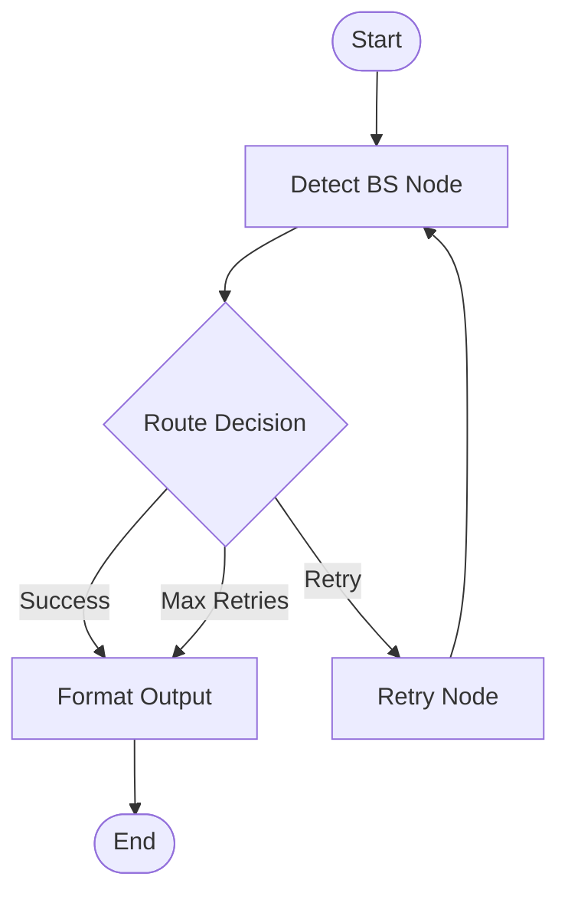

# Iteration 2: Introduction to LangGraph

**Time Estimate**: 15 minutes

## Learning Objectives
- Understand LangGraph core concepts: nodes, state, edges, routing
- Build your first graph-based agent
- Learn two execution patterns: single run and chat loop
- Add simple retry logic using graph cycles

## What We're Building
A BS detector using LangGraph that teaches:
1. **Node**: A function that processes state
2. **State**: Shared data between nodes
3. **Edge**: Connection between nodes
4. **Routing**: Conditional flow control
5. **Graph**: Complete state machine

## Core Concepts

### 1. State - The Data Container
```python
from pydantic import BaseModel
from typing import Optional

class BSDetectorState(BaseModel):
    """Everything our graph needs to remember - with validation!"""
    claim: str
    retry_count: int = 0
    max_retries: int = 3
    verdict: Optional[str] = None
    confidence: Optional[int] = None
    reasoning: Optional[str] = None
    error: Optional[str] = None
    result: Optional[dict] = None
```

### 2. Node - The Processing Unit
```python
def detect_bs_node(state: BSDetectorState) -> dict:
    """A node is just a function that takes state and returns updates"""
    claim = state.claim  # Access as attribute with Pydantic
    
    # Use baseline detector from Iteration 1
    result = check_claim(claim, llm)
    
    # Return only the fields you want to update
    return {
        "verdict": result.get("verdict"),
        "confidence": result.get("confidence"),
        "reasoning": result.get("reasoning"),
        "result": result  # Keep full result for compatibility
    }
```

### 3. Edge - The Connection
```python
# Simple edge: A → B
graph.add_edge("detect", "output")

# Conditional edge: A → (B or C)
graph.add_conditional_edges(
    "detect",
    routing_function,
    {
        "retry": "retry_node",
        "done": "output"
    }
)
```

### 4. Routing - The Decision Maker
```python
def route_after_detection(state: BSDetectorState) -> str:
    """Routing function decides which edge to take"""
    if state.verdict and state.verdict != "ERROR":
        return "success"
    elif state.retry_count < state.max_retries:
        return "retry"
    else:
        return "error"
```

### 5. Graph - The Complete System
```python
from langgraph.graph import StateGraph

# Create graph
graph = StateGraph(BSDetectorState)

# Add nodes
graph.add_node("detect", detect_bs_node)
graph.add_node("retry", retry_node)

# Add edges and routing
graph.add_conditional_edges(
    "detect",
    route_after_detection,
    {"success": "format", "retry": "retry", "error": "format"}
)

# Compile
app = graph.compile()
```

## Step-by-Step Implementation

### Step 1: Define the State
Create `modules/m2_langgraph.py`:
```python
from pydantic import BaseModel
from typing import Optional

# State for our graph - MUST use Pydantic BaseModel
class BSDetectorState(BaseModel):
    # Input
    claim: str
    
    # Processing control
    retry_count: int = 0
    max_retries: int = 3
    
    # Output from detection
    verdict: Optional[str] = None
    confidence: Optional[int] = None
    reasoning: Optional[str] = None
    
    # Error tracking
    error: Optional[str] = None
    
    # Keep original result format
    result: Optional[dict] = None
    
    model_config = {
        "arbitrary_types_allowed": True
    }
```

### Step 2: Build the Nodes
```python
from modules.m1_baseline import check_claim  # Reuse from Iteration 1!
from config.llm_factory import LLMFactory

def detect_bs_node(state: BSDetectorState) -> dict:
    """Main detection node - wraps baseline detector"""
    try:
        # Get LLM
        llm = LLMFactory.create_llm()
        
        # Use the baseline detector from Iteration 1
        result = check_claim(state.claim, llm)
        
        # Return state updates
        return {
            "verdict": result.get("verdict"),
            "confidence": result.get("confidence"),
            "reasoning": result.get("reasoning"),
            "error": result.get("error"),
            "result": result  # Keep full result
        }
    except Exception as e:
        return {
            "error": str(e),
            "retry_count": state.retry_count + 1
        }

def retry_node(state: BSDetectorState) -> dict:
    """Retry node with exponential backoff"""
    import time
    retry_count = state.retry_count
    wait_time = 2 ** (retry_count - 1)  # 1s, 2s, 4s
    print(f"⏳ Retry {retry_count}/{state.max_retries} - waiting {wait_time}s...")
    time.sleep(wait_time)
    return {}  # No state changes, just wait

def format_output_node(state: BSDetectorState) -> dict:
    """Format the final output to match baseline format"""
    # If we have a stored result, use it
    if state.result:
        return {}
    
    # Otherwise, construct result from state
    result = {
        "verdict": state.verdict or "ERROR",
        "confidence": state.confidence or 0,
        "reasoning": state.reasoning or "No analysis available",
    }
    
    if state.error:
        result["error"] = state.error
    
    return {"result": result}
```

### Step 3: Create the Routing Logic
```python
def route_after_detection(state: BSDetectorState) -> str:
    """Decide what to do after detection attempt"""
    # Success - we have a verdict
    if state.verdict and state.verdict != "ERROR":
        return "success"
    
    # Error - check if we should retry
    if state.retry_count < state.max_retries:
        return "retry"
    
    # Give up
    return "error"
```

### Step 4: Build the Graph
```python
from langgraph.graph import StateGraph, END

def create_bs_detector_graph():
    """Build our BS detector graph"""
    # Initialize graph with our state
    graph = StateGraph(BSDetectorState)
    
    # Add nodes (the workers)
    graph.add_node("detect", detect_bs_node)
    graph.add_node("retry", retry_node)
    graph.add_node("format_output", format_output_node)
    
    # Set entry point
    graph.set_entry_point("detect")
    
    # Add routing
    graph.add_conditional_edges(
        "detect",
        route_after_detection,
        {
            "success": "format_output",
            "retry": "retry", 
            "error": "format_output"
        }
    )
    
    # Retry goes back to detect
    graph.add_edge("retry", "detect")
    
    # Format output leads to end
    graph.add_edge("format_output", END)
    
    # Compile the graph
    return graph.compile()
```

### Step 5: Two Ways to Execute

#### Pattern 1: Single Execution
```python
def check_claim_with_graph(claim: str, max_retries: int = 3) -> dict:
    """Execute the graph once - maintains baseline interface"""
    # Create the graph
    app = create_bs_detector_graph()
    
    # Initialize state with Pydantic model
    initial_state = BSDetectorState(
        claim=claim,
        retry_count=0,
        max_retries=max_retries
    )
    
    # Run the graph
    final_state = app.invoke(initial_state)
    
    # Return the formatted result
    return final_state.get("result") or {
        "verdict": "ERROR",
        "confidence": 0,
        "reasoning": "Graph execution failed",
        "error": "Unknown error"
    }
```

#### Pattern 2: Interactive Chat Loop
```python
def chat_loop():
    """Simple interactive loop"""
    # Create the graph once
    app = create_bs_detector_graph()
    
    print("BS Detector Chat (type 'quit' to exit)")
    print("-" * 40)
    
    while True:
        # Get user input
        claim = input("\nEnter claim: ").strip()
        
        # Check for exit
        if claim.lower() in ['quit', 'exit', 'q']:
            print("Goodbye!")
            break
        
        # Skip empty input
        if not claim:
            continue
        
        # Process claim
        print("\nAnalyzing...")
        
        # Run the graph with Pydantic state
        state = app.invoke(BSDetectorState(
            claim=claim,
            retry_count=0,
            max_retries=3
        ))
        
        result = state.get("result") or {}
        
        # Show results
        if result.get("verdict"):
            print(f"\n📊 Verdict: {result['verdict']}")
            print(f"🎯 Confidence: {result['confidence']:.1%}")
            print(f"💭 Reasoning: {result['reasoning']}")
        else:
            print(f"\n❌ Error: {result.get('error', 'Unknown error')}")
```

## Complete Working Example
```python
# modules/m2_complete.py
if __name__ == "__main__":
    # Example 1: Single run
    print("=== Single Run Example ===")
    run_once("The Boeing 747 can fly backwards")
    
    # Example 2: Interactive chat
    print("\n=== Chat Mode ===")
    chat_loop()
```

## Visualizing Your Graph

```python
import base64
from IPython.display import Image, display

def render_mermaid_diagram(graph_def):
    """Render mermaid diagram using mermaid.ink API"""
    graph_bytes = graph_def.encode("utf-8")
    base64_string = base64.b64encode(graph_bytes).decode("ascii")
    image_url = f"https://mermaid.ink/img/{base64_string}?type=png"
    return Image(url=image_url)

# Visualize the graph
app = create_bs_detector_graph()
mermaid_code = app.get_graph().draw_mermaid()
display(render_mermaid_diagram(mermaid_code))
```

This produces:


## Key Takeaways

### 1. Nodes are Simple Functions
```python
def my_node(state) -> dict:
    # Do work
    # Return updates
```

### 2. State is a Pydantic Model
```python
class MyState(BaseModel):
    field1: str
    field2: int = 0  # With defaults!
```

### 3. Routing is Conditional Logic
```python
def router(state) -> str:
    if condition:
        return "path1"
    return "path2"
```

### 4. Graphs are Composable
- Start simple
- Add nodes incrementally
- Test each piece

## Common Patterns

### Error Handling Pattern
```python
graph.add_conditional_edges(
    "process",
    lambda s: "retry" if s.get("error") and s["retries"] < 3 else "done",
    {"retry": "retry_node", "done": END}
)
```

### Logging Pattern
```python
def log_node(state):
    print(f"State: {state}")
    return {}  # No updates, just log

graph.add_node("log", log_node)
graph.add_edge("detect", "log")
graph.add_edge("log", END)
```

## Testing Your Graph
```python
def test_graph():
    app = create_bs_detector_graph()
    
    # Test success case
    result = app.invoke({
        "claim": "The 747 has four engines",
        "retry_count": 0,
        "max_retries": 3
    })
    assert result.get("verdict") is not None
    
    # Test with mock LLM for predictable results
    # ... 
```

## Next Steps
1. Try adding a new node (e.g., confidence adjustment)
2. Add more complex routing logic
3. Experiment with parallel nodes
4. Add state persistence

## Resources
- [LangGraph Quickstart](https://python.langchain.com/docs/langgraph/quickstart)
- [State Management](https://python.langchain.com/docs/langgraph/concepts/state)
- [Conditional Edges](https://python.langchain.com/docs/langgraph/how-tos/conditional-edges)