# AI Workflows vs AI Agents: When to Use What

## Overview

This document explains the fundamental differences between AI workflows and AI agents, helping you choose the right approach for your use case. Based on insights from [Anthropic's Building Effective Agents](https://www.anthropic.com/news/building-effective-agents) and real-world implementation experience.

## Table of Contents
1. [Key Definitions](#key-definitions)
2. [AI Workflows](#ai-workflows)
3. [AI Agents](#ai-agents)
4. [Decision Framework](#decision-framework)
5. [Implementation Examples](#implementation-examples)
6. [Best Practices](#best-practices)

## Key Definitions

### AI Workflow
A **predefined, structured process** where code orchestrates LLM calls through fixed paths. The control flow is deterministic and managed by your application logic.

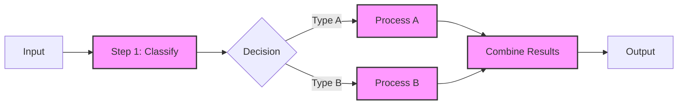

### AI Agent
An **autonomous system** where the LLM itself decides what actions to take, which tools to use, and how to achieve goals. The control flow is dynamic and emergent.

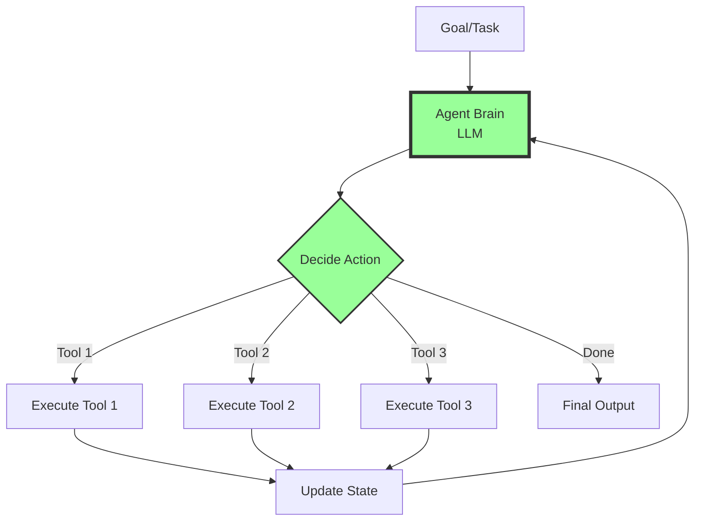

## AI Workflows

### Types of Workflows

#### 1. Prompt Chaining
Sequential processing where each step's output feeds into the next.

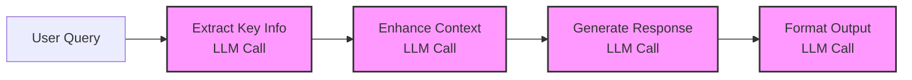

**Example Use Case**: Document summarization pipeline
```python
def summarize_document(doc):
    # Step 1: Extract main points
    main_points = llm.invoke("Extract main points from: " + doc)
    
    # Step 2: Identify themes
    themes = llm.invoke("Identify themes in: " + main_points)
    
    # Step 3: Generate summary
    summary = llm.invoke(f"Summarize based on themes {themes} and points {main_points}")
    
    return summary
```

#### 2. Routing Workflows
Classify input and route to specialized handlers.

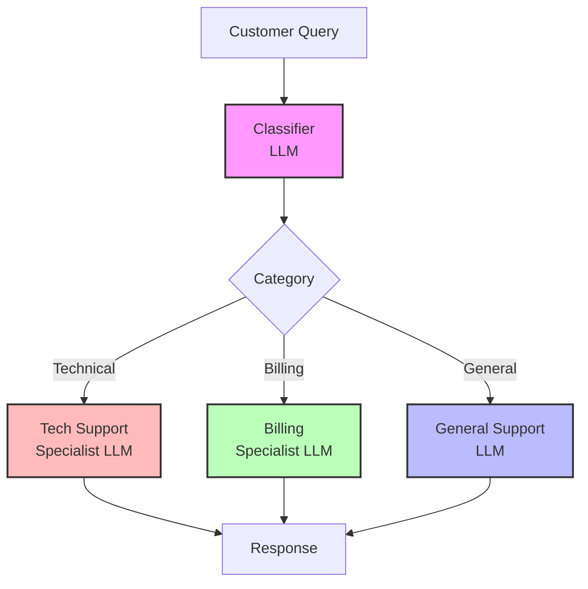

#### 3. Parallel Workflows
Execute multiple tasks simultaneously for efficiency.

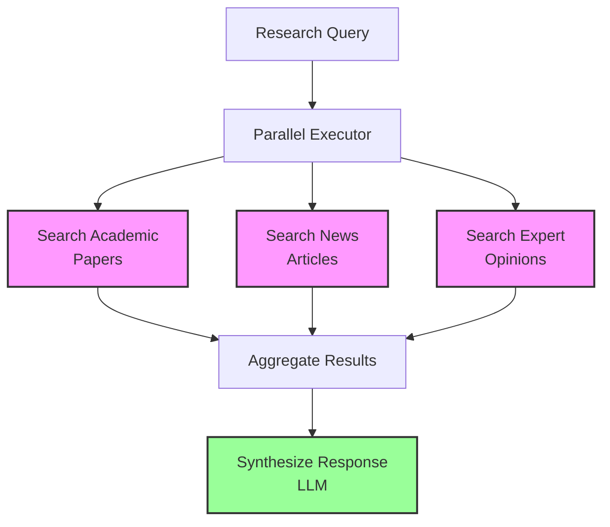

#### 4. Orchestrator-Workers Pattern
Central coordinator delegates to specialized workers.

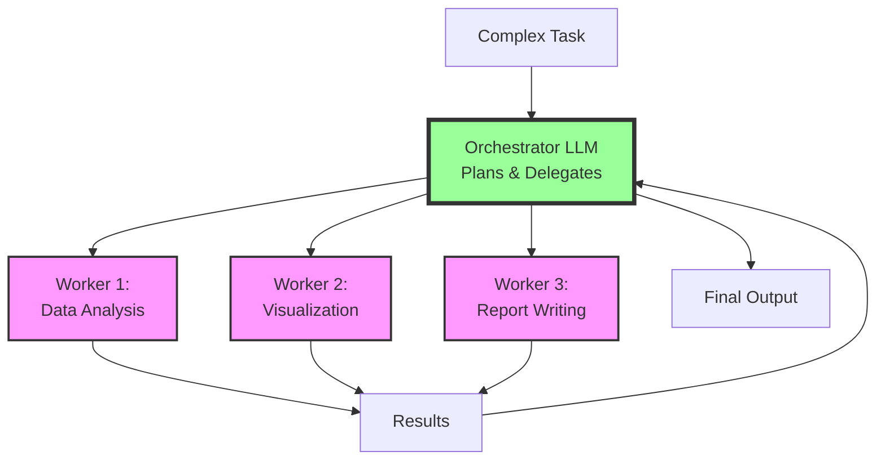

### When to Use Workflows

✅ **Use workflows when:**
- Task has well-defined steps
- Process is repeatable and predictable
- You need consistency and reliability
- Compliance/audit requirements exist
- Performance is critical (less LLM calls)
- You can decompose the problem clearly

❌ **Don't use workflows when:**
- Problem space is open-ended
- Steps cannot be predetermined
- Flexibility is more important than structure
- Task requires exploration or creativity

## AI Agents

### Agent Architecture

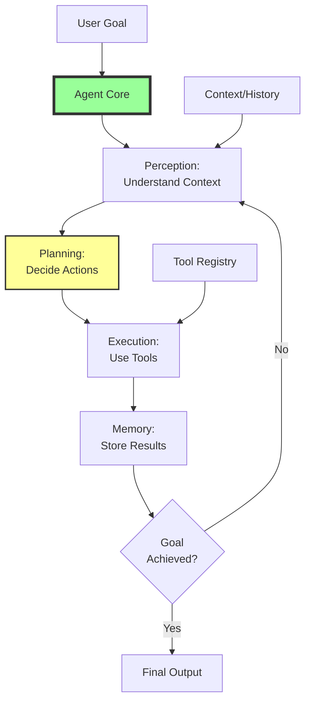

### Agent Components

#### 1. Decision Engine
The LLM that makes autonomous decisions.

```python
class AgentBrain:
    def decide_next_action(self, state, available_tools, goal):
        prompt = f"""
        Goal: {goal}
        Current State: {state}
        Available Tools: {available_tools}
        
        What should be the next action?
        """
        return llm.invoke(prompt)
```

#### 2. Tool System
Capabilities the agent can invoke.

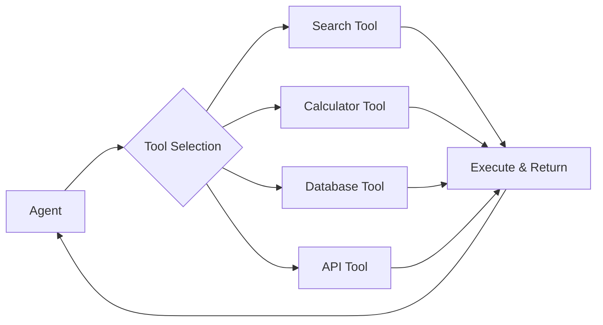

#### 3. Memory Management
Maintaining context across interactions.

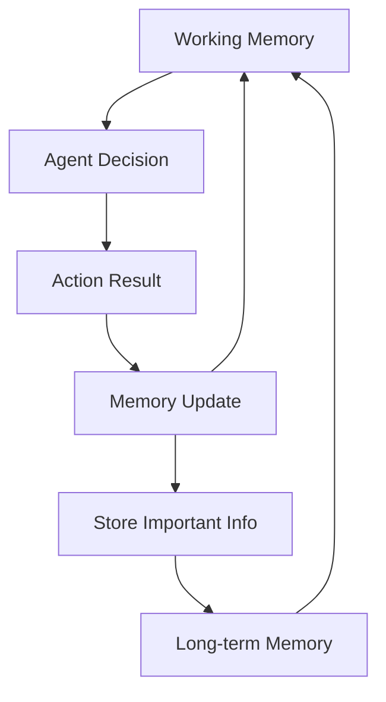

### When to Use Agents

✅ **Use agents when:**
- Problem requires exploration
- Number of steps is unpredictable
- Task needs creative problem-solving
- Flexibility and adaptation are crucial
- Handling edge cases automatically
- Building conversational systems

❌ **Don't use agents when:**
- Task is simple and well-defined
- Predictability is critical
- Cost needs to be controlled (more LLM calls)
- Debugging needs to be straightforward
- Regulatory compliance is strict

## Decision Framework

### The Decision Tree

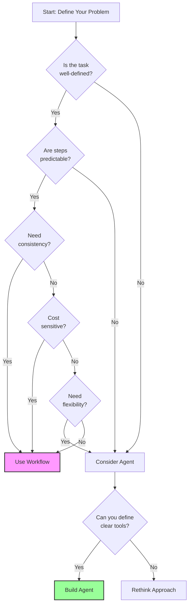

### Evaluation Criteria

| Criteria | Workflow | Agent |
|----------|----------|--------|
| **Predictability** | ⭐⭐⭐⭐⭐ | ⭐⭐ |
| **Flexibility** | ⭐⭐ | ⭐⭐⭐⭐⭐ |
| **Cost Efficiency** | ⭐⭐⭐⭐ | ⭐⭐ |
| **Debugging Ease** | ⭐⭐⭐⭐⭐ | ⭐⭐ |
| **Scalability** | ⭐⭐⭐ | ⭐⭐⭐⭐ |
| **Autonomy** | ⭐ | ⭐⭐⭐⭐⭐ |
| **Consistency** | ⭐⭐⭐⭐⭐ | ⭐⭐⭐ |

## Implementation Examples

### Example 1: Customer Support - Workflow Approach

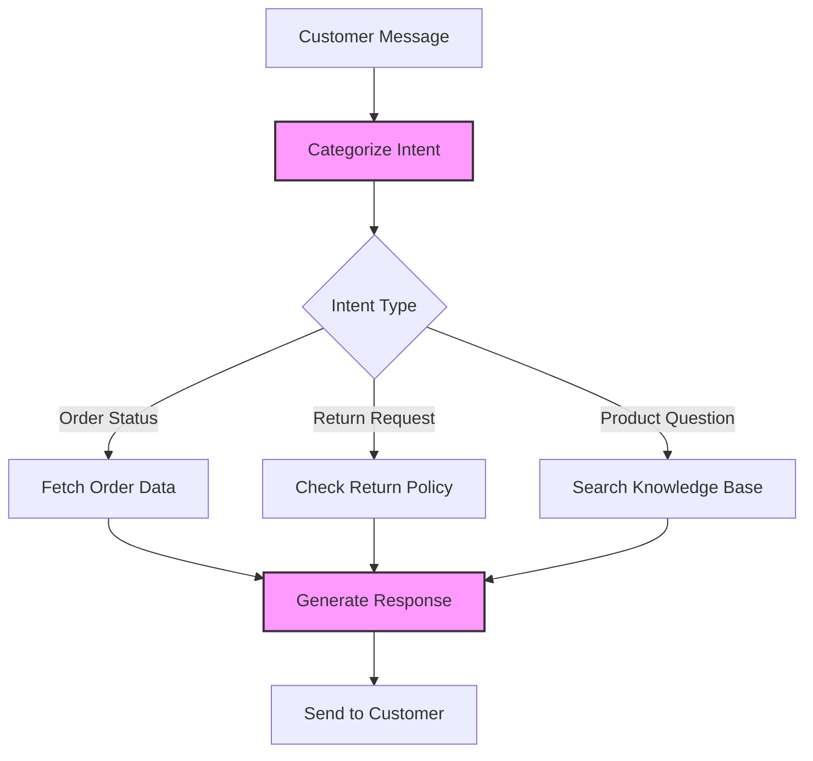

```python
def handle_customer_query(message):
    # Fixed workflow
    intent = classify_intent(message)
    
    if intent == "order_status":
        order_data = fetch_order_data(message)
        response = generate_order_response(order_data)
    elif intent == "return_request":
        policy = check_return_policy(message)
        response = generate_return_response(policy)
    else:
        kb_results = search_knowledge_base(message)
        response = generate_kb_response(kb_results)
    
    return response
```

### Example 2: Research Assistant - Agent Approach

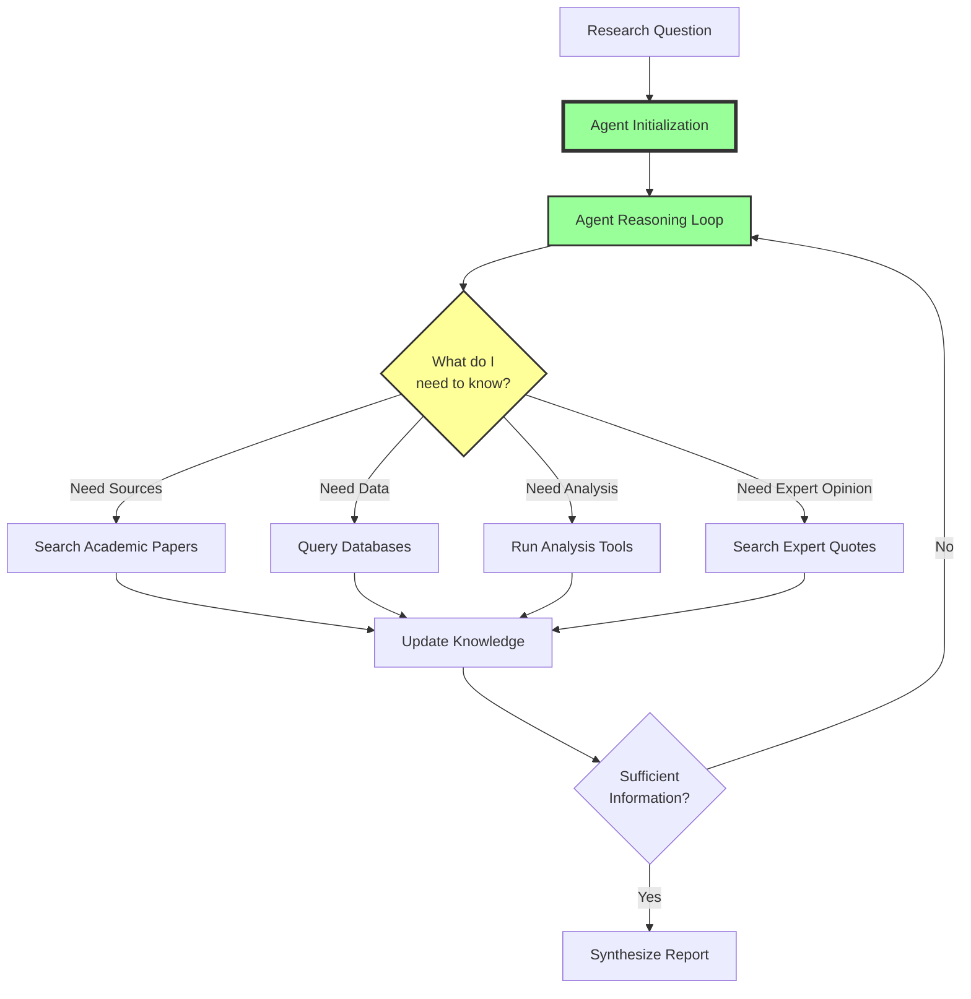

```python
class ResearchAgent:
    def research(self, question):
        state = {"question": question, "findings": [], "done": False}
        
        while not state["done"]:
            # Agent decides next action
            action = self.decide_action(state)
            
            if action.type == "search":
                results = self.search_tool(action.query)
                state["findings"].extend(results)
            elif action.type == "analyze":
                analysis = self.analyze_tool(state["findings"])
                state["findings"].append(analysis)
            elif action.type == "complete":
                state["done"] = True
                
        return self.synthesize_report(state["findings"])
```

### Example 3: Hybrid Approach

Sometimes the best solution combines both patterns:

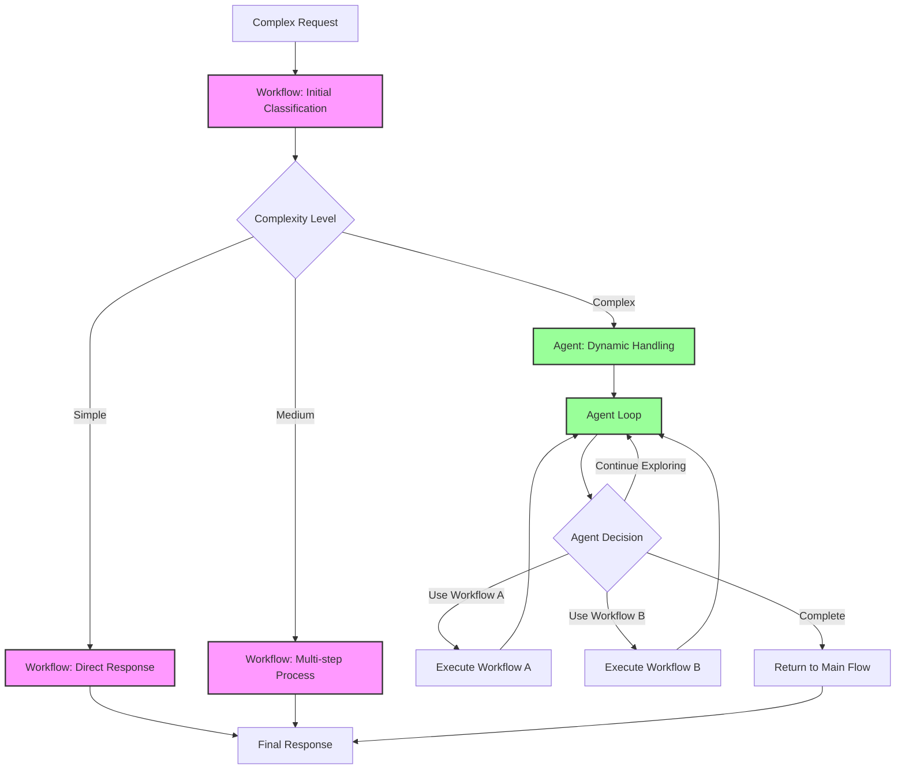

## Best Practices

### General Principles

1. **Start Simple**: Always begin with the simplest approach that could work
2. **Iterate Based on Data**: Add complexity only when metrics show it's needed
3. **Measure Everything**: Track success rates, costs, and user satisfaction
4. **Design for Failure**: Both workflows and agents need error handling

### Workflow Best Practices

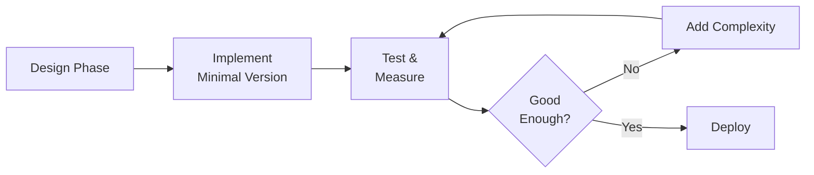

1. **Map the Happy Path First**: Define the common case before edge cases
2. **Use Typed Interfaces**: Strong typing prevents errors
3. **Log Decision Points**: Track why the workflow went certain directions
4. **Version Your Workflows**: Enable A/B testing and rollbacks

### Agent Best Practices

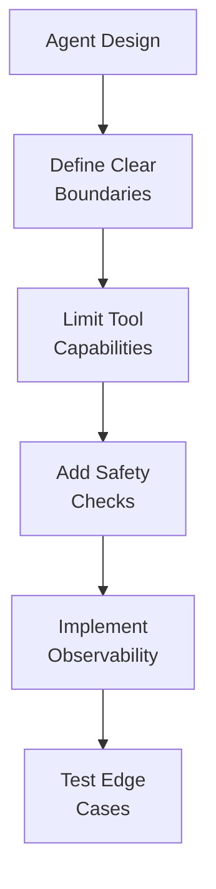

1. **Constrain the Action Space**: Limit what tools agents can use
2. **Set Clear Success Criteria**: Agents need to know when they're done
3. **Implement Timeouts**: Prevent infinite loops
4. **Human-in-the-Loop**: Add checkpoints for critical decisions

### Common Pitfalls to Avoid

#### Workflow Pitfalls
- ❌ Over-engineering for rare edge cases
- ❌ Creating workflows that are too rigid
- ❌ Not handling errors gracefully
- ❌ Ignoring performance implications

#### Agent Pitfalls
- ❌ Giving agents too much autonomy too quickly
- ❌ Not tracking agent decisions for debugging
- ❌ Underestimating costs of many LLM calls
- ❌ Building agents when workflows would suffice

## Migration Strategies

### From Workflow to Agent

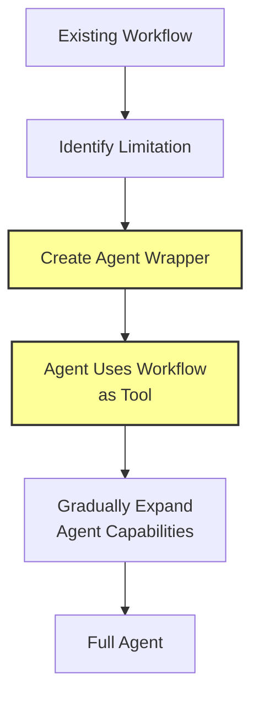

### From Agent to Workflow

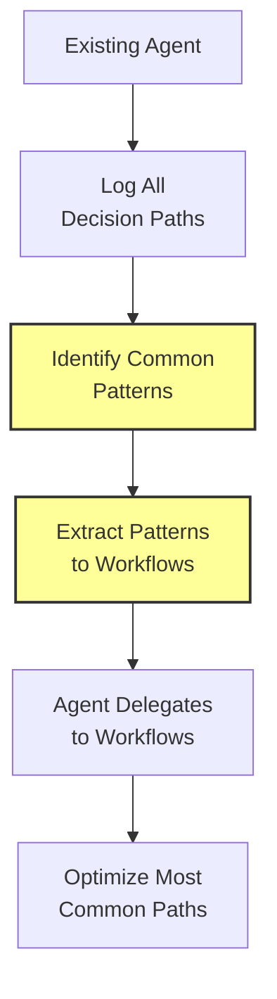

## Conclusion

The choice between workflows and agents isn't binary. Success comes from:

1. **Understanding your problem deeply**
2. **Starting with the simplest solution**
3. **Measuring and iterating based on real usage**
4. **Being willing to hybrid approaches**

Remember: **"Success in the LLM space isn't about building the most sophisticated system. It's about building the right system for your needs."**

### Quick Decision Guide

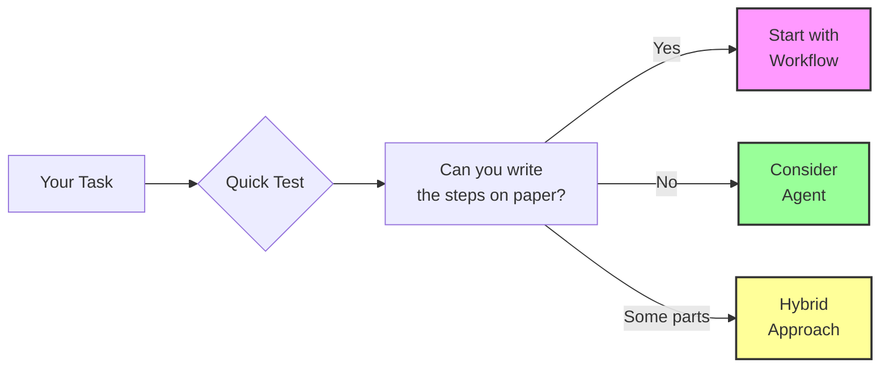

The future of AI systems lies not in choosing one approach over the other, but in knowing when and how to apply each pattern effectively.