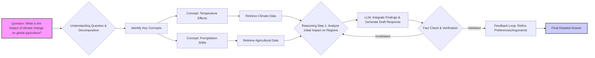
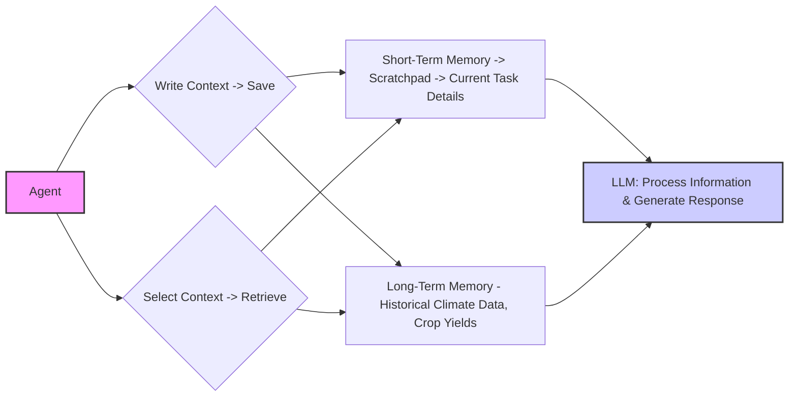
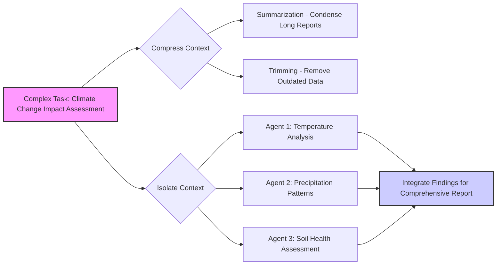
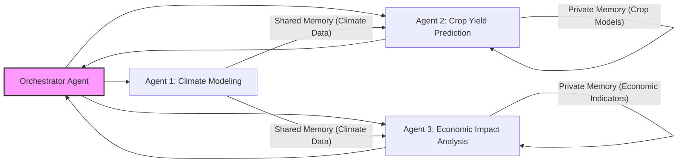

## White Paper: Mastering Agent Memory – A Guide to Effective Context Management

**Introduction:**

Artificial Intelligence agents are rapidly evolving, moving beyond simple task completion towards complex reasoning and long-running interactions.  A critical component enabling this evolution is *memory* - the ability for an agent to retain and utilize information over time. This white paper explores the core concepts of agent memory management, outlining practical strategies for building robust and efficient AI agents capable of tackling increasingly sophisticated challenges. We will focus on a real-world example – assessing the impact of climate change on global agriculture – to illustrate these principles.  We’ll cover techniques ranging from basic storage and retrieval to advanced compression and isolation methods, culminating in an overview of memory management within multi-agent systems.

---

### Section 1: Understanding Agent Memory - The Foundation

**Why Does an Agent Need a “Memory”?**

Large Language Models (LLMs), the brains behind many AI agents, operate with a limited *context window*. Think of this as the LLM’s short-term memory or RAM.  Just like computer RAM, it has finite capacity. When an agent undertakes a complex task involving multiple steps and extensive data, relying solely on the context window quickly becomes unsustainable. Information gets lost, leading to inconsistencies, repetitions, and even fabricated responses (hallucinations). 

Effective memory management allows agents to store crucial information *outside* of the immediate context window and retrieve it when needed, enabling them to maintain coherence and accuracy over extended interactions.  Without a robust memory system, an agent’s performance will inevitably degrade as task complexity increases. Consider our example: assessing climate change impacts on agriculture requires tracking numerous variables (temperature, precipitation, soil conditions) across different regions and time periods. An agent without adequate memory would struggle to synthesize this information effectively.

**Visualizing the Need for Memory & LLM Decision Flow**

**Diagram Explanation:** This diagram illustrates the LLM’s decision-making process. Notice how information flows from initial question to concept identification and data retrieval.  Without a mechanism to retain key findings (temperature effects, precipitation shifts) throughout this process, the final answer will be unreliable. The limited context window is represented by the flow between each node – only the immediate previous steps are fully accessible without external memory.

---

### Section 2: Building Basic Memory - Write & Select

**Saving and Retrieving Information – The Core Principles**

The first step in building agent memory is establishing mechanisms for *writing* information to storage and *selecting* relevant pieces when needed.  We can categorize these approaches into two main strategies:

*   **Write Context (Saving):** This involves storing data outside the LLM’s context window. Two common methods are:
    *   **Short-Term Memory (Scratchpad):** Ideal for temporary storage during a single task or session.  Think of it as a notepad.
    *   **Long-Term Memory:** Designed to retain information across multiple sessions, enabling the agent to learn and adapt over time.
*   **Select Context (Retrieving):** Once data is stored, the agent needs to efficiently retrieve relevant pieces based on the current task or query. This requires a search mechanism that can identify the most pertinent information.

**Illustrating Write & Select with Climate Change Data**

**Example:** Imagine our agent is analyzing the impact of rising sea levels on rice production in Bangladesh. 

1.  **Write:** The agent finds data indicating a 5mm/year rise in sea level – it saves this to its long-term memory. It also notes specific details about current Bangladeshi rice farming practices in its scratchpad for the immediate task.
2.  **Select:** When assessing the potential impact on rice yields, the agent retrieves both the sea level rise data *and* the information about local farming techniques to provide a nuanced analysis.

---

### Section 3: Scaling Up - Compress & Isolate

**Optimizing Memory Usage – Compression and Isolation Techniques**

As tasks become more complex, managing memory efficiently becomes crucial. Two advanced strategies address this challenge:

*   **Compress Context:** Reducing the amount of information stored without sacrificing essential details.
    *   **Summarization:** Condensing lengthy texts into shorter summaries while preserving key insights.
    *   **Trimming:** Removing outdated or irrelevant information to free up space.
*   **Isolate Context:** Breaking down complex tasks into smaller, more manageable sub-tasks handled by separate agents or modules. Each agent focuses on a specific aspect of the problem, reducing the overall memory burden.

**Visualizing Compression & Isolation in Action**

**Example:** 

*   **Compress:** The agent summarizes a lengthy IPCC report on climate change into a concise overview of key findings.
*   **Isolate:** Instead of one agent handling the entire assessment, separate agents focus on temperature impacts, precipitation patterns, and soil health. Each agent maintains its own focused memory, reducing overall complexity.

---

### Section 4: Memory Management in Multi-Agent Systems

**Orchestrating Memories – Collaboration & Coordination**

Multi-agent systems offer a powerful approach to tackling complex problems. However, they also introduce new challenges for memory management. Key considerations include:

*   **Shared vs. Private Memory:** Agents can have both shared memories (accessible to all) and private memories (restricted to individual agents).
*   **Knowledge Hand-off:** Mechanisms are needed for agents to share relevant information with each other, such as summaries of findings or key data points.
*   **Coordination is Key:** A central orchestrator agent can help manage the flow of information and ensure consistency across the system.

**Diagramming a Multi-Agent Memory Architecture**

**Example:** In our climate change scenario, an orchestrator agent coordinates three specialized agents. The *Climate Modeling Agent* generates and shares climate projections (stored in shared memory).  The *Crop Yield Prediction Agent* uses this data along with its own private crop models to forecast yields. Finally, the *Economic Impact Analysis Agent* assesses the economic consequences of yield changes using its own private economic indicators.

---

**Conclusion:**

Effective agent memory management is no longer a luxury – it’s a necessity for building intelligent and reliable AI systems. By understanding the principles outlined in this white paper – writing, selecting, compressing, and isolating context – developers can create agents capable of tackling increasingly complex challenges.  The key takeaway is that memory isn't just about *storing* information; it's about strategically managing it to optimize performance, accuracy, and adaptability. As AI continues to evolve, mastering these techniques will be crucial for unlocking the full potential of intelligent agents in a wide range of applications, from climate change mitigation to personalized healthcare and beyond.