# Deep Research Agent: A Thought Experiment

## The Question: "What is the impact of climate change on global agriculture?"

This document explores how a sophisticated AI research agent would approach this complex question, demonstrating the difference between a simple query-response system and a true autonomous research agent.

## Table of Contents
1. [Simple Chatbot Response](#simple-chatbot-response)
2. [Deep Research Agent Approach](#deep-research-agent-approach)
3. [Agent Architecture](#agent-architecture)
4. [Research Process Visualization](#research-process-visualization)
5. [Key Capabilities Required](#key-capabilities-required)
6. [Implementation Considerations](#implementation-considerations)

## Simple Chatbot Response

A traditional chatbot might respond:

> "Climate change significantly impacts global agriculture through rising temperatures, changing precipitation patterns, and extreme weather events. This leads to reduced crop yields, shifts in growing zones, and increased pest pressures. Adaptation strategies include developing climate-resistant crops and improving irrigation systems."

**Problems with this approach:**
- Surface-level understanding
- No sources cited
- Missing regional nuances
- No quantitative analysis
- Lacks actionable insights

## Deep Research Agent Approach

### Initial Planning Phase

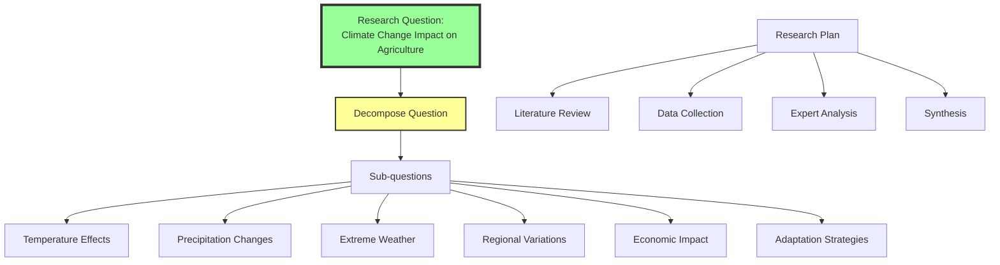

### Agent's Research Strategy

The agent would develop a multi-phase research plan:

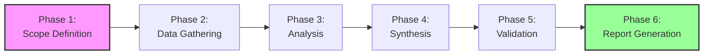

## Agent Architecture

### Complete System Design

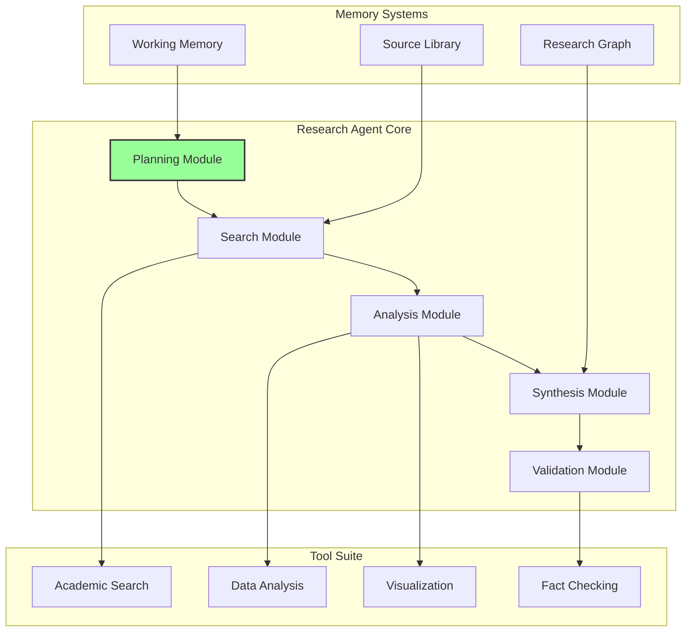

### Research Process Flow

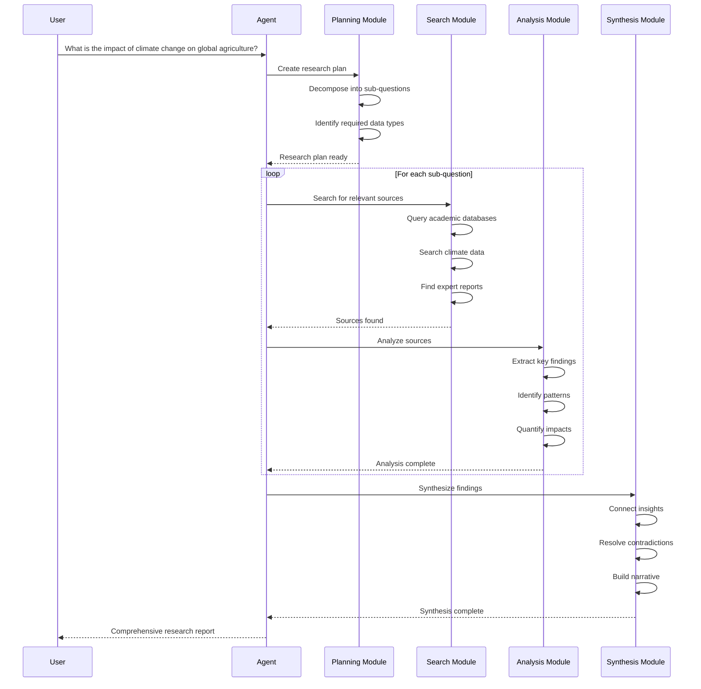

## Research Process Visualization

### Phase 1: Scope Definition (Hours 0-2)

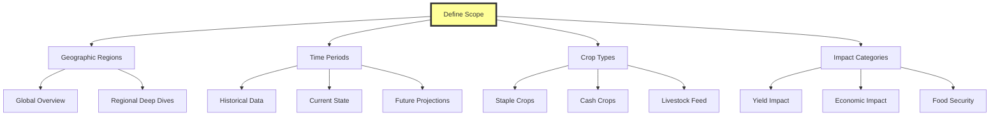

**Agent Actions:**
1. Identifies need for both breadth and depth
2. Recognizes interdisciplinary nature
3. Sets research boundaries
4. Estimates required resources

### Phase 2: Data Gathering (Hours 2-8)

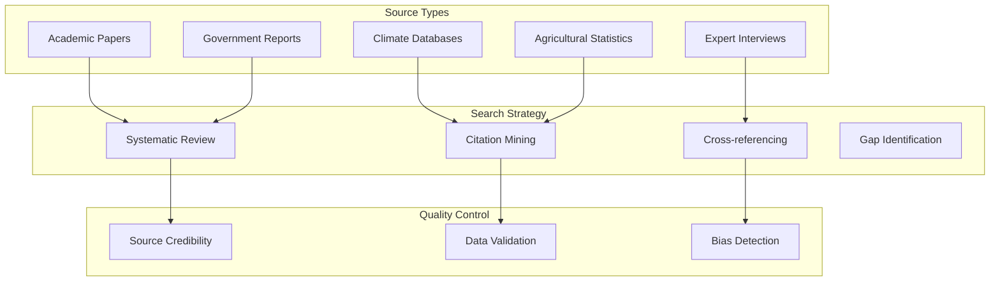

**Agent's Information Architecture:**

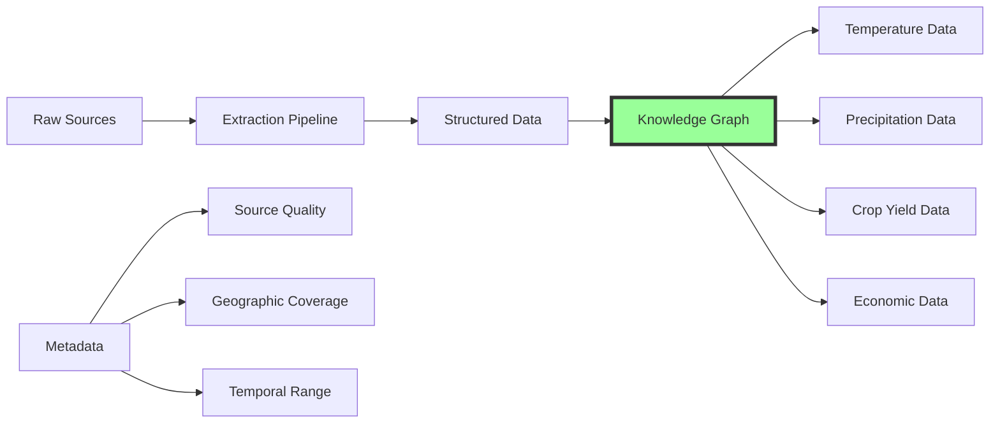

### Phase 3: Analysis (Hours 8-16)

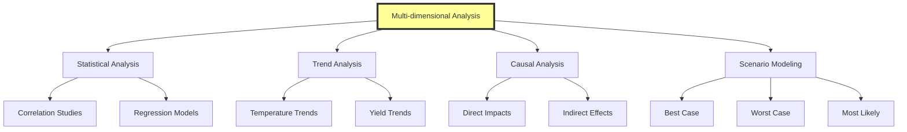

**Deep Insights Discovery:**

The agent would uncover nuanced findings like:

1. **Regional Variations**
   - Sub-Saharan Africa: 20% yield decrease by 2050
   - Northern Europe: 10% yield increase for some crops
   - Southeast Asia: Flooding risk increases 40%

2. **Crop-Specific Impacts**
   ```mermaid
   graph TD
       A[Crop Impact Analysis] --> B[Wheat: -15% global]
       A --> C[Rice: -10% + flooding]
       A --> D[Maize: -18% in tropics]
       A --> E[Soybeans: +5% in temperate]
   ```

3. **Cascading Effects**
   ```mermaid
   graph TD
       A[Primary Impact] --> B[Yield Reduction]
       B --> C[Price Increase]
       C --> D[Food Insecurity]
       D --> E[Migration]
       E --> F[Political Instability]
       
       style A fill:#fcc,stroke:#333,stroke-width:2px
       style F fill:#fcc,stroke:#333,stroke-width:2px
   ```

### Phase 4: Synthesis (Hours 16-20)

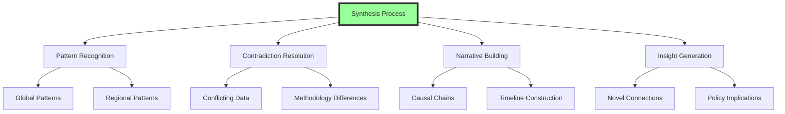

### Phase 5: Validation (Hours 20-22)

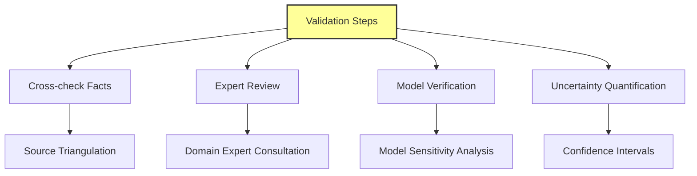

### Phase 6: Report Generation (Hours 22-24)

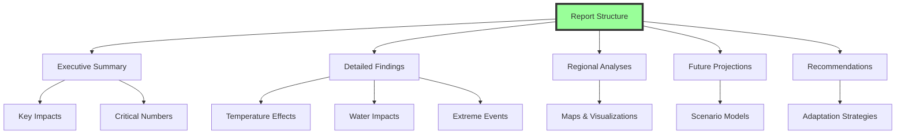

## Key Capabilities Required

### 1. Autonomous Planning

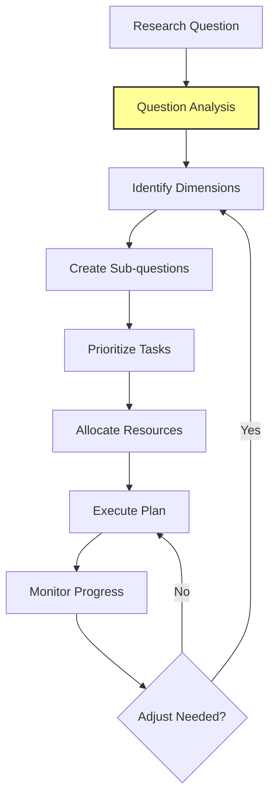

### 2. Multi-Source Integration

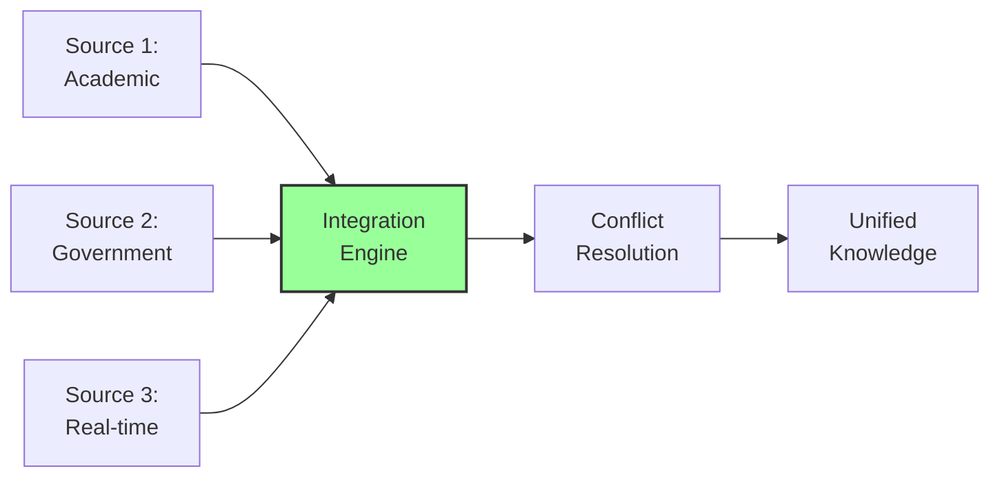

### 3. Adaptive Learning

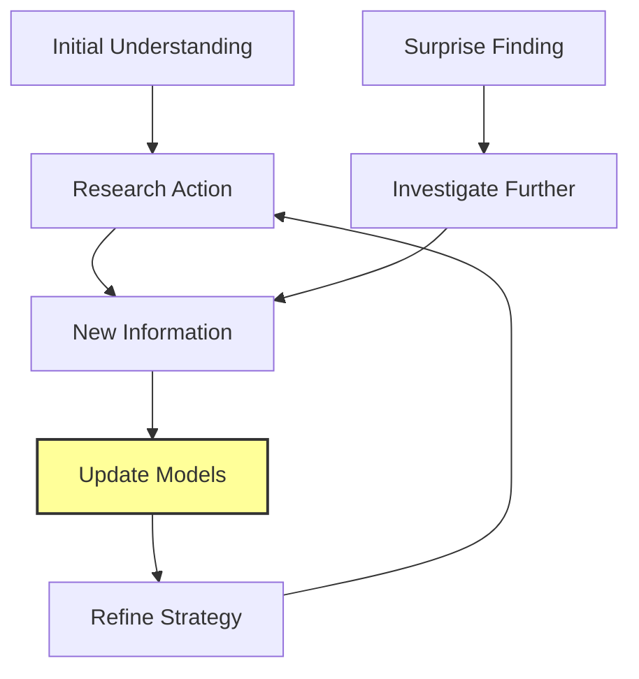

### 4. Quality Assurance

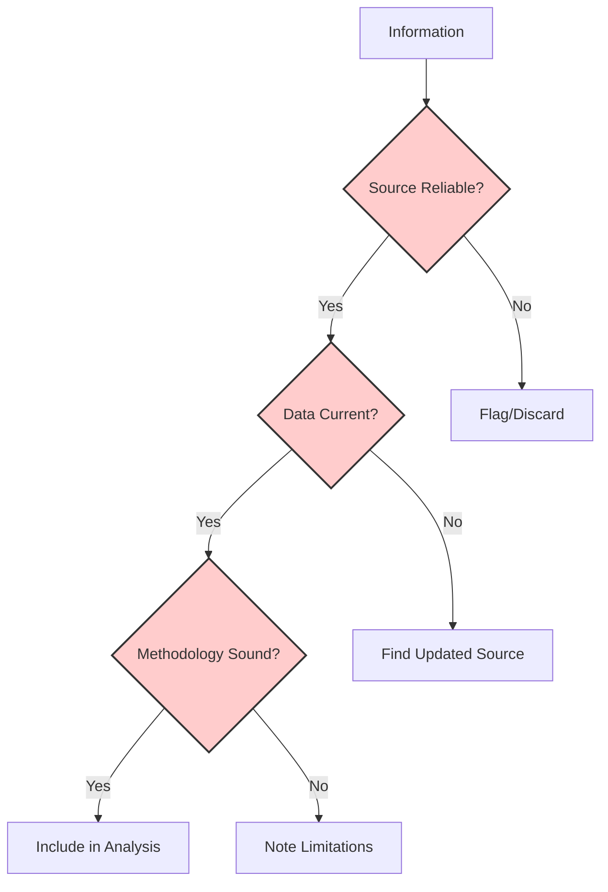

## Implementation Considerations

### Technical Architecture

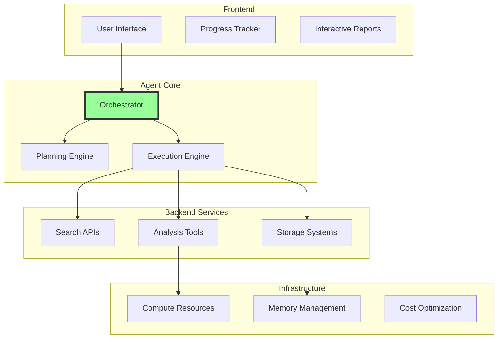

### Cost-Benefit Analysis

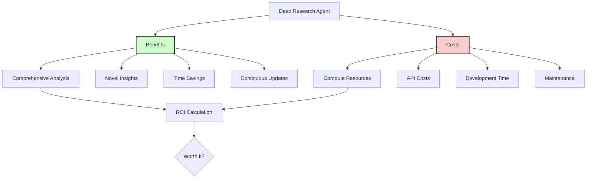

### Challenges and Solutions

| Challenge | Solution |
|-----------|----------|
| **Information Overload** | Intelligent filtering and prioritization |
| **Conflicting Sources** | Multi-criteria validation framework |
| **Computational Costs** | Caching and incremental processing |
| **Maintaining Focus** | Hierarchical goal tracking |
| **Quality Control** | Automated fact-checking pipelines |

## Sample Output Structure

### Executive Summary
```markdown
# Climate Change Impact on Global Agriculture: Comprehensive Analysis

## Key Findings
- Global crop yields projected to decline 10-25% by 2050
- 600 million additional people at risk of hunger
- $5 trillion economic impact over next 30 years
- Adaptation could reduce impacts by 40%

## Regional Highlights
[Interactive map with regional data]

## Critical Actions Required
1. Immediate implementation of climate-smart agriculture
2. Investment in drought-resistant crop varieties
3. Infrastructure upgrades for water management
```

### Detailed Sections
1. **Quantitative Analysis**
   - Statistical models with confidence intervals
   - Time series projections
   - Economic impact assessments

2. **Regional Deep Dives**
   - Country-specific impacts
   - Local adaptation strategies
   - Case studies of successful interventions

3. **Interactive Elements**
   - Scenario explorers
   - Data visualizations
   - Policy simulators

## Conclusion

A deep research agent approaching this question would:

1. **Go Beyond Surface Level** - Not just stating impacts but quantifying them
2. **Provide Regional Nuance** - Understanding local variations
3. **Connect Disciplines** - Linking climate, agriculture, economics, and society
4. **Generate Novel Insights** - Finding patterns humans might miss
5. **Create Actionable Intelligence** - Specific recommendations with evidence

The difference between a chatbot response and a research agent's output is like comparing a Wikipedia summary to a comprehensive research institute report. The agent doesn't just retrieve information - it conducts actual research.

### The Future of AI Research

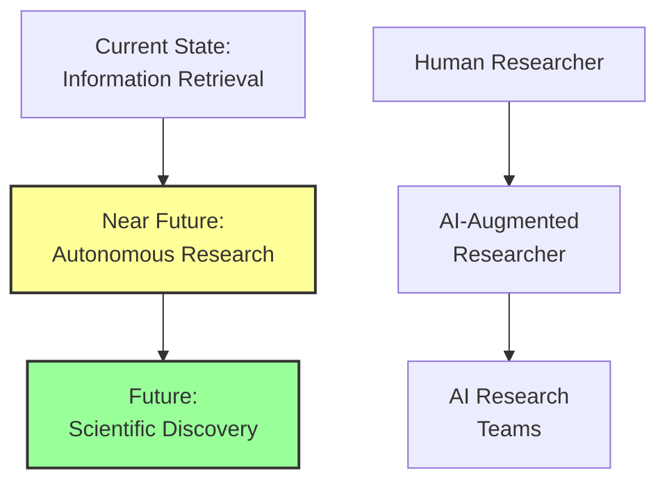

This thought experiment demonstrates that true AI agents don't just answer questions - they investigate them, pursuing knowledge with the thoroughness and creativity of human researchers, but at unprecedented scale and speed.