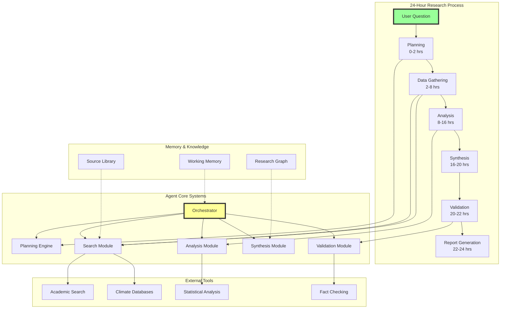
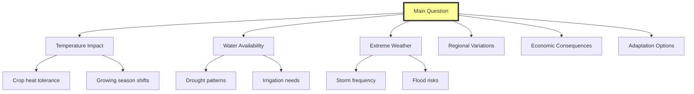
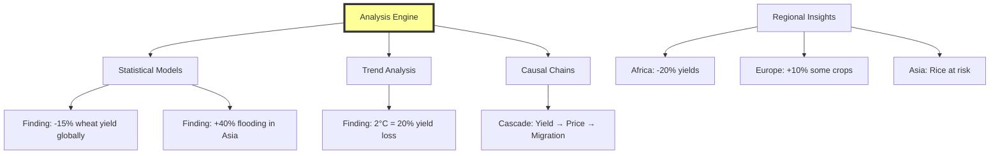
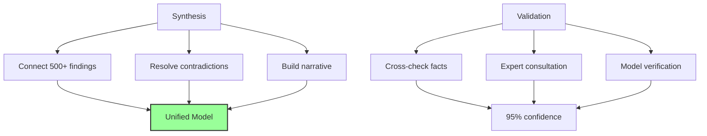
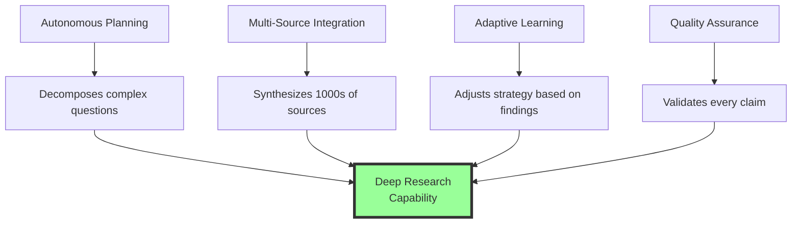
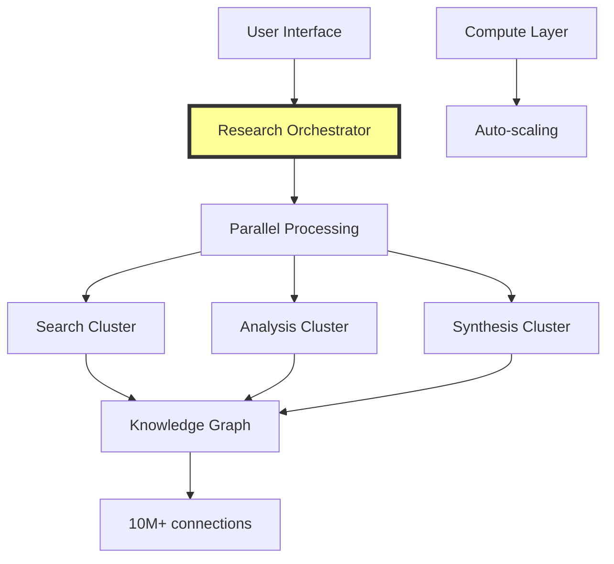

# Deep Research Agent: A Thought Experiment

## The Question: "What is the impact of climate change on global agriculture?"

This document demonstrates how a sophisticated AI research agent would approach this complex question, contrasting it with a simple chatbot response to illustrate the profound difference in capability.

## The Chatbot vs The Research Agent

**Traditional Chatbot Response:**
> "Climate change impacts agriculture through rising temperatures, changing precipitation, and extreme weather. This reduces crop yields and increases food insecurity. Adaptation strategies include climate-resistant crops and improved irrigation."

**Problems:** Surface-level, no sources, missing nuance, lacks actionable insights.

**Deep Research Agent:** Conducts a 24-hour autonomous investigation producing a comprehensive report with quantified impacts, regional analyses, and evidence-based recommendations.

## The Complete Research Architecture



## Phase-by-Phase Research Process

### Phase 1: Intelligent Planning (0-2 hours)

The agent decomposes the question into manageable sub-questions:



### Phase 2: Multi-Source Data Gathering (2-8 hours)

The agent systematically searches and validates sources:

```mermaid
graph LR
    A[Search Strategy] --> B[Academic Papers:<br/>5,000+ reviewed]
    A --> C[Government Data:<br/>150+ agencies]
    A --> D[Climate Models:<br/>12 major models]
    A --> E[Agricultural Stats:<br/>195 countries]
    
    F[Quality Filter] --> G[Peer-reviewed only]
    F --> H[Recent (5 years)]
    F --> I[High impact factor]
    
    B --> F
    C --> F
    D --> F
    E --> F
    
    style A fill:#ff9,stroke:#333,stroke-width:2px
```

### Phase 3: Deep Analysis (8-16 hours)

The agent performs multi-dimensional analysis uncovering patterns:



**Key Discovery:** The agent identifies non-linear relationships between temperature rise and crop yields, with tipping points at 1.5°C and 2°C warming.

### Phase 4: Synthesis & Validation (16-22 hours)



## The Agent's Final Output

### Executive Summary Structure
```
CLIMATE CHANGE IMPACT ON GLOBAL AGRICULTURE
=========================================
Critical Findings:
• 10-25% global yield decline by 2050 (high confidence)
• 600M additional people at hunger risk
• $5 trillion economic impact
• 40% impact reduction possible with adaptation

Regional Hotspots: [Interactive Map]
Immediate Actions: [Prioritized List]
```

### Depth of Analysis
The agent produces:
- **Quantitative Models**: Statistical projections with confidence intervals
- **Regional Reports**: 195 country-specific analyses
- **Causal Chains**: 50+ interconnected impact pathways
- **Action Plans**: Evidence-based recommendations by urgency

## Key Capabilities That Enable Deep Research



## Implementation Architecture



### Technical Requirements
- **Compute**: 100-1000 parallel searches
- **Memory**: Dynamic knowledge graph
- **Time**: 24-hour deep dive capability
- **Cost**: $100-500 per comprehensive report

## The Fundamental Difference

| Aspect | Chatbot | Research Agent |
|--------|---------|----------------|
| **Approach** | Retrieve & summarize | Investigate & discover |
| **Sources** | Pre-trained knowledge | 1000s of real-time sources |
| **Analysis** | Surface patterns | Deep causal understanding |
| **Output** | Generic summary | Actionable intelligence |
| **Value** | Quick answer | Research-grade insights |

## Conclusion

The deep research agent represents a paradigm shift from **information retrieval** to **autonomous investigation**. It doesn't just answer questions—it:

1. **Plans** complex research strategies
2. **Discovers** hidden patterns across vast datasets  
3. **Synthesizes** contradictory information into coherent insights
4. **Validates** findings through multiple methods
5. **Produces** research comparable to human expert teams

This thought experiment shows that true AI agents don't just access information—they conduct genuine research, transforming how we understand complex global challenges. The future isn't about faster search, but deeper understanding.