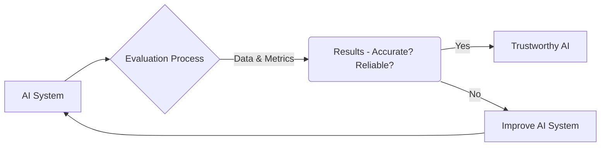
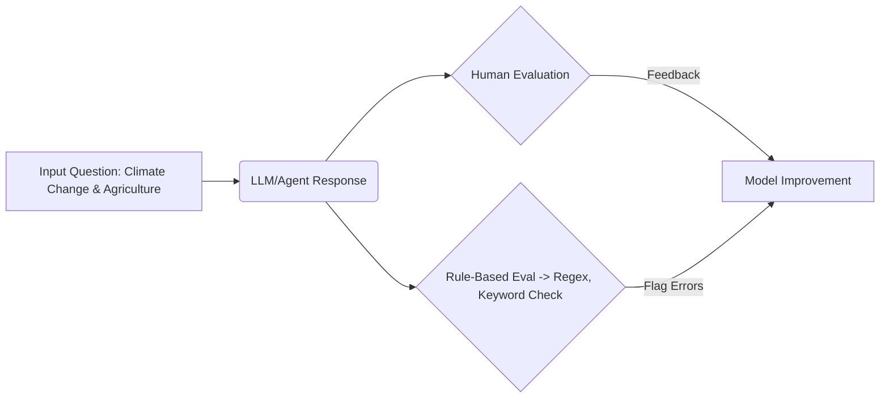
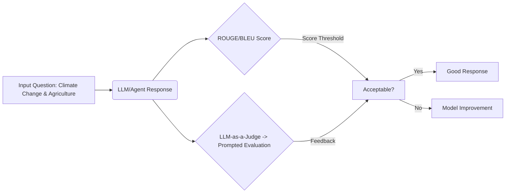
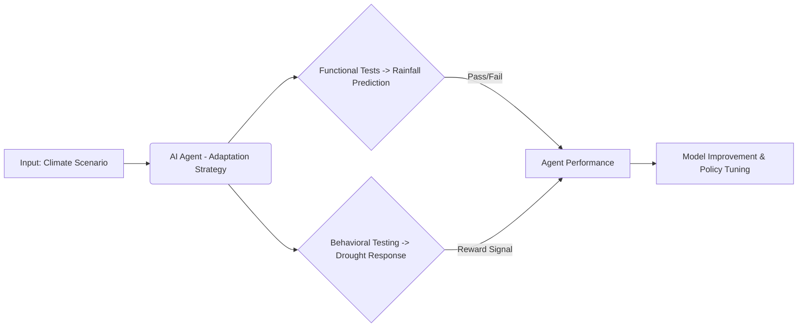
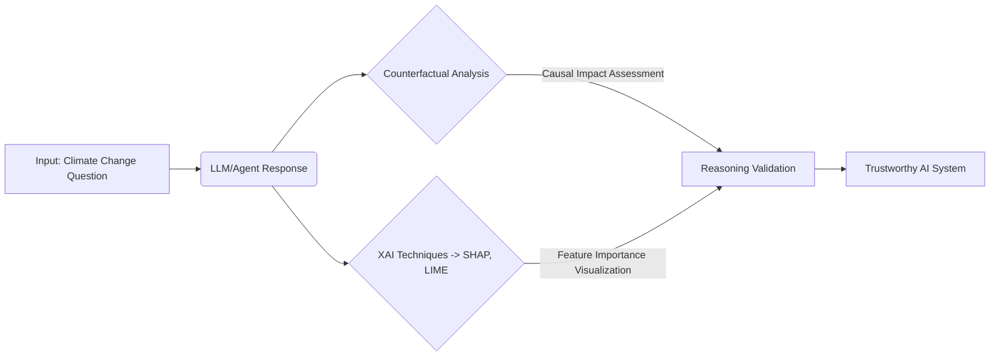

## Building Trustworthy AI System - A Guide to Evaluation

---

### Introduction – Why We Need to Check the Work of AI

Artificial Intelligence (AI) is becoming more powerful and is starting to help us tackle big challenges like climate change and food security. But even smart AI systems can make mistakes, show biases, or give answers that aren’t quite right. That's why *evaluation* – carefully checking the work of AI – is so important. Think of it like quality control for any product; we need to ensure AI provides reliable information before we use it to make decisions. This paper explains how to evaluate AI systems, especially those dealing with complex topics like climate change and its impact on farming. We’ll start with simple checks and move towards more advanced methods. Our guiding question will be: **“What is the impact of climate change on global agriculture?”** – helping us see how different evaluation techniques work in practice.

**Why Evaluation Matters:** Without good evaluation, we risk:
* **Incorrect Information:** AI might give wrong answers about important issues like crop yields or water availability.
* **Biased Results:** AI could unfairly favor certain regions or farming practices.
* **Unreliable Predictions:** AI forecasts of future climate impacts might be inaccurate, leading to poor planning.

Here’s a simple diagram showing the evaluation process:

This cycle of evaluation and improvement is crucial for building trustworthy AI. We need to know *not just what* the AI says, but *how* it arrived at that answer.

---

### Basic Checks: Human & Rule-Based Evaluation

The first step is using straightforward methods to check if an AI’s answers are generally correct and make sense.  We'll focus on two key techniques:

* **Human Evaluation:** Experts review the AI’s responses, judging them based on accuracy, completeness, and clarity. This is like having a teacher grade a student’s work.
* **Rule-Based Evaluation:** We create specific rules that the AI *must* follow. If it breaks those rules, we know there's a problem.  This often involves using regular expressions or predefined keyword lists.

**Applying to Our Question:** For “What is the impact of climate change on global agriculture?”, we could:
* **Human Evaluation:** Ask agricultural scientists to rate answers for factual correctness and whether they cover key impacts (like changes in crop yields or water availability).
* **Rule-Based Evaluation:** Set a rule that any answer *must* mention at least one specific impact of climate change on farming.

**Limitations:** These methods are good starting points, but they can be slow and don’t tell us *why* the AI made certain choices. They also lack scalability for complex systems.

---

### Measuring Performance: Metric-Based Evaluation & LLM-as-a-Judge

Moving beyond simple checks requires automated methods to quantify AI performance. Here are some key evaluation types:

* **ROUGE (Recall-Oriented Understudy for Gisting Evaluation):**  Commonly used for summarization tasks, it measures the overlap of n-grams between the generated summary and reference summaries.
* **BLEU (Bilingual Evaluation Understudy):** Used primarily in machine translation, BLEU assesses the similarity between a candidate translation and one or more reference translations.
* **Perplexity:** Measures how well a language model predicts a sample text. Lower perplexity indicates better performance.
* **LLM-as-a-Judge (using frameworks like OpenAI's Evals):** Leveraging another powerful AI model to evaluate the first AI's responses based on specific criteria, often using prompt engineering for nuanced assessment.

**Applying to Our Question:** 
* **ROUGE/BLEU:** We could create several expert answers to “What is the impact of climate change on global agriculture?” and use these metrics to see how closely the AI's response matches those examples.
* **LLM-as-a-Judge:**  We can prompt a second LLM with instructions like: "Evaluate this answer for accuracy, completeness, and clarity. Does it cite credible sources?"

**Limitations:** Metric-based evaluation relies on having good “gold standard” answers. LLM-as-a-judge requires careful prompting to avoid bias in the judging AI.

---

### Evaluating Complex Systems: Functional & Behavioral Testing of Agents

When AI isn't just answering questions, but *acting* as an agent – making decisions and taking actions – we need more sophisticated evaluation methods.

* **Functional Testing:** Verifying specific functionalities.  This often involves unit tests to check individual components of the agent.
* **Behavioral Testing (Reinforcement Learning Evaluation):** Observing how the agent behaves in different situations, often using a simulated environment or real-world data. Metrics include reward accumulation and task completion rate.
* **Reward Shaping:** Designing a reward function that encourages desired behaviors and penalizes undesirable ones.

**Applying to Our Question:** Imagine an AI agent tasked with helping farmers adapt to climate change. We could:
* **Functional Testing:** Verify that the agent can accurately predict future rainfall patterns for a specific farm location using historical data and climate models.
* **Behavioral Testing:** Present the agent with a scenario where a sudden drought occurs and see if it recommends appropriate actions (like switching to more drought-resistant crops) within defined constraints (cost, resources).

**Limitations:** Behavioral testing requires creating realistic scenarios, which can be challenging. It’s also difficult to anticipate all possible situations an agent might encounter.

---

### Advanced Evaluation: Counterfactual Reasoning & Explainability + Conclusion

To truly trust AI, we need to understand its reasoning process. This requires advanced evaluation techniques:

* **Counterfactual Analysis:**  Exploring "what if" scenarios to assess the agent’s understanding of causal relationships. Tools like Causal Impact can help quantify these effects.
* **Explainable AI (XAI) Techniques:** Making the AI's decision-making process transparent. Common methods include:
    * **SHAP (SHapley Additive exPlanations):**  Assigning importance values to each feature based on its contribution to the prediction.
    * **LIME (Local Interpretable Model-agnostic Explanations):** Approximating a complex model with a simpler, interpretable one locally around a specific prediction.
    * **Attention Mechanisms:** Visualizing which parts of the input data the AI focused on when making its decision.

**Applying to Our Question:** We can ask the AI agent: “If we plant more drought-resistant crops, how much will that reduce the risk of crop failure?”  XAI techniques like SHAP values can reveal *why* the agent believes this is true – for example, by showing which data points about the crops’ water usage were most influential.

**Conclusion:** Evaluating AI systems is an ongoing process, not a one-time event. As AI becomes more powerful and integrated into our lives, robust evaluation will be essential for ensuring its benefits are realized responsibly. By starting with basic checks and progressing towards advanced techniques like counterfactual reasoning and explainability, we can build trustworthy AI that helps us address critical challenges like climate change and food security. The journey from simple to complex evaluation is vital for unlocking the full potential of AI while mitigating its risks. Continuous monitoring, adaptation, and a commitment to transparency will be key to success.

