# Google's Agent-to-Agent (A2A) Protocol: Enabling AI Agent Collaboration

## Overview

The Agent-to-Agent (A2A) Protocol, announced by Google in April 2025, is an open standard that enables AI agents to discover, communicate, and collaborate with each other across different platforms and frameworks. With support from over 50 technology partners including Atlassian, Box, Cohere, Intuit, LangChain, MongoDB, PayPal, Salesforce, SAP, ServiceNow, and major consulting firms, A2A represents a significant step toward creating an interconnected AI agent ecosystem.

**Official Resources:**
- [A2A Announcement](https://developers.googleblog.com/en/a2a-a-new-era-of-agent-interoperability/)
- [GitHub Repository](https://github.com/a2aproject/A2A)
- License: Apache 2.0

## Table of Contents
1. [Core Concepts](#core-concepts)
2. [Architecture](#architecture)
3. [Agent Communication Flow](#agent-communication-flow)
4. [Key Features](#key-features)
5. [Implementation Guide](#implementation-guide)
6. [A2A vs MCP](#a2a-vs-mcp)
7. [Real-World Applications](#real-world-applications)
8. [Future of Agent Ecosystems](#future-of-agent-ecosystems)

## Core Concepts

### What Problem Does A2A Solve?

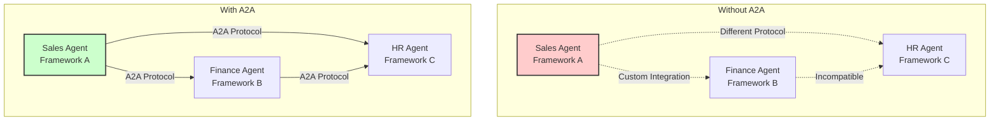

A2A provides a **universal language** for AI agents to:
- Discover each other's capabilities
- Negotiate task delegation
- Exchange information securely
- Coordinate complex workflows

### Client vs Remote Agents

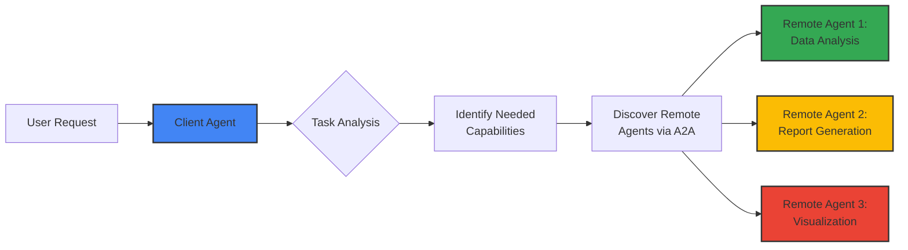

- **Client Agent**: Initiates tasks and orchestrates workflow
- **Remote Agent**: Provides specialized capabilities and executes tasks

## Architecture

### A2A Protocol Stack

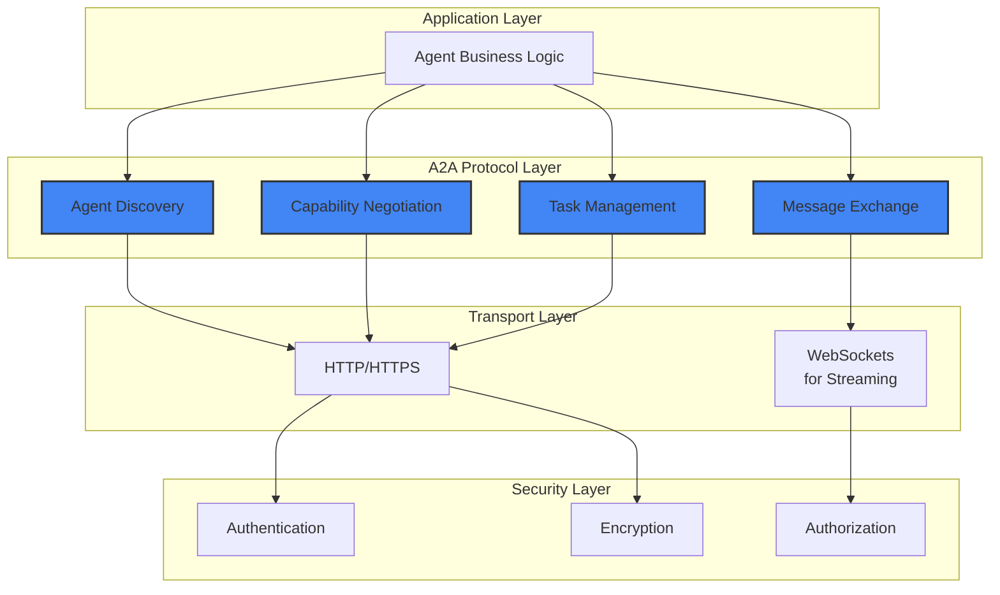

### Agent Cards: The Discovery Mechanism

Every A2A agent publishes an "Agent Card" - a JSON document describing its capabilities:

```json
{
  "name": "FinancialAnalysisAgent",
  "version": "1.0.0",
  "description": "Specialized in financial data analysis and reporting",
  "capabilities": [
    {
      "name": "analyze_revenue",
      "description": "Analyze revenue trends and patterns",
      "input_schema": {
        "type": "object",
        "properties": {
          "time_period": {"type": "string"},
          "metrics": {"type": "array", "items": {"type": "string"}}
        }
      },
      "output_schema": {
        "type": "object",
        "properties": {
          "analysis": {"type": "object"},
          "visualizations": {"type": "array"}
        }
      }
    }
  ],
  "supported_modalities": ["text", "data", "charts"],
  "endpoint": "https://api.company.com/agents/financial"
}
```

## Agent Communication Flow

### Basic Communication Sequence

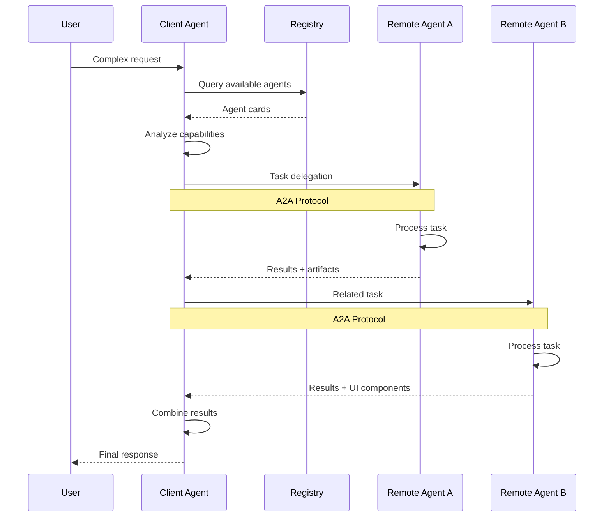

### Multi-Modal Communication

A2A supports various content types and modalities:

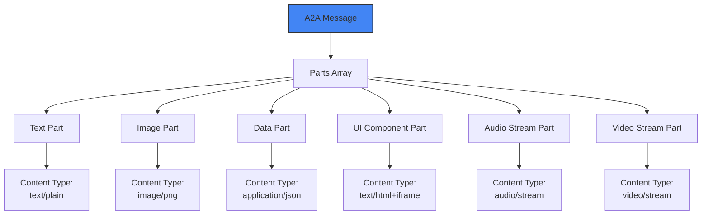

## Key Features

### 1. Dynamic Capability Discovery

```mermaid
graph TD
    A[Client Agent] --> B[Broadcast Need:<br/>"Financial Analysis"]
    B --> C[Registry/Directory]
    C --> D[Match Capabilities]
    D --> E[Return Matching Agents]
    
    E --> F[Agent 1:<br/>Excel Analysis]
    E --> G[Agent 2:<br/>ML Predictions]
    E --> H[Agent 3:<br/>Risk Assessment]
    
    A --> I{Select Best Match}
    F --> I
    G --> I
    H --> I
    
    style A fill:#4285f4,stroke:#333,stroke-width:2px
    style C fill:#34a853,stroke:#333,stroke-width:2px
```

### 2. Task-Oriented Communication

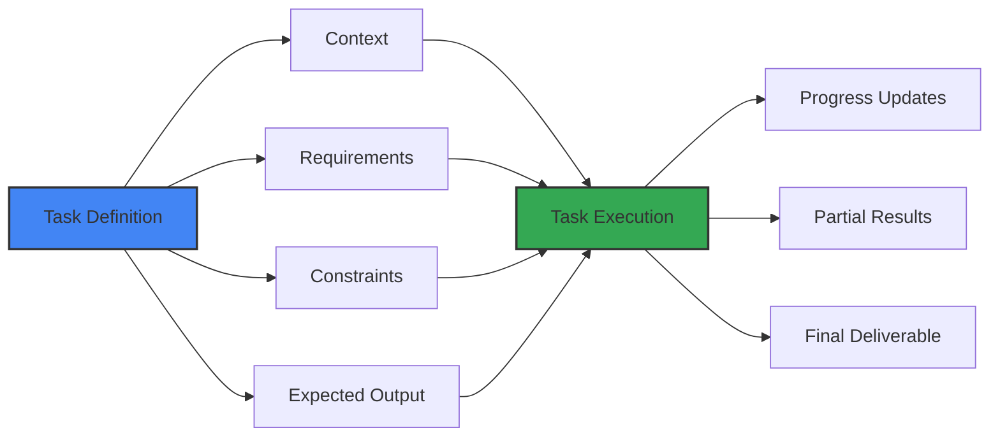

### 3. UI Capability Negotiation

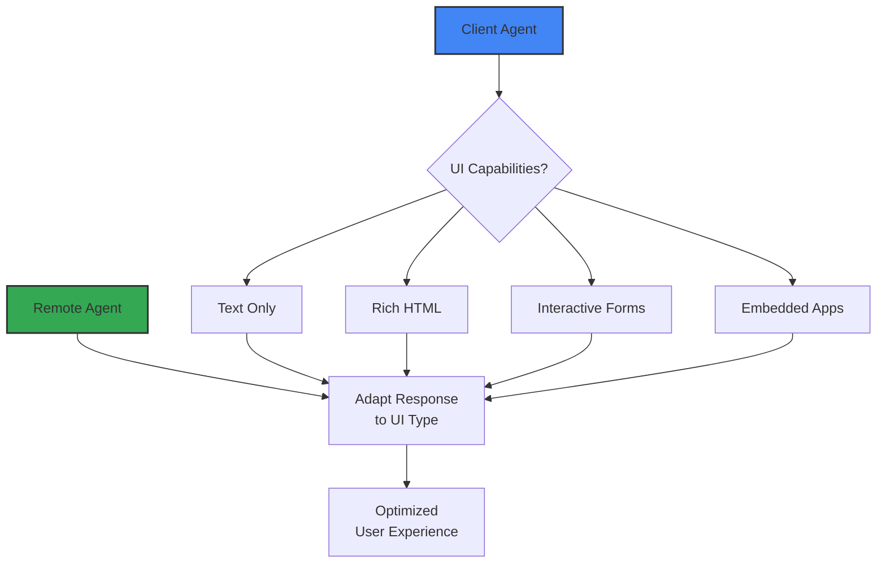

### 4. Streaming Support

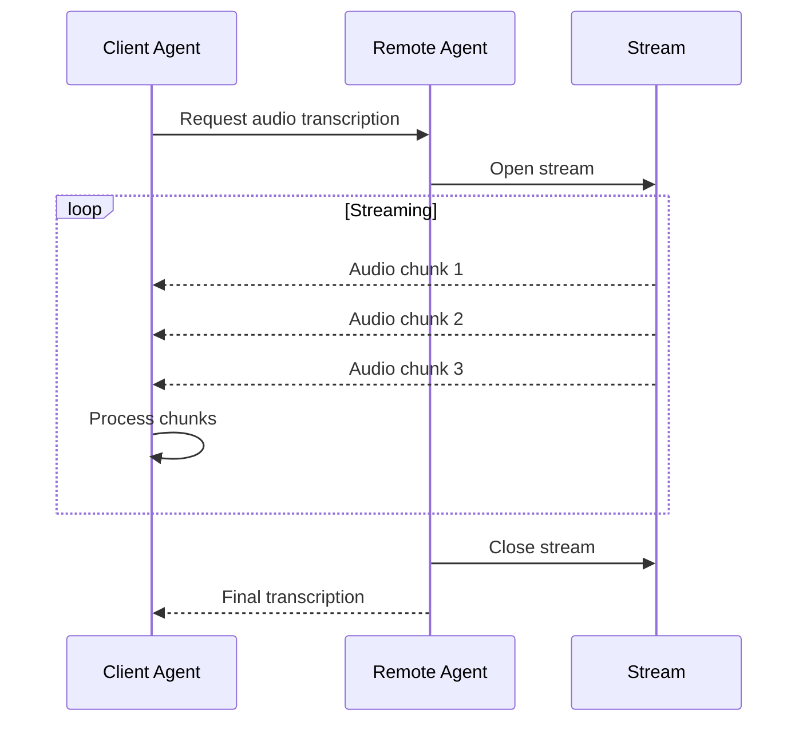

## Implementation Guide

### Creating an A2A Agent

```python
# Example A2A Agent Implementation
class A2AAgent:
    def __init__(self, name, capabilities):
        self.name = name
        self.capabilities = capabilities
        self.agent_card = self.generate_agent_card()
    
    def generate_agent_card(self):
        return {
            "name": self.name,
            "version": "1.0.0",
            "capabilities": self.capabilities,
            "endpoint": f"https://api.example.com/agents/{self.name}"
        }
    
    def handle_task(self, task):
        """Process incoming A2A task requests"""
        # Validate task against capabilities
        if not self.can_handle(task):
            return {"error": "Task not supported"}
        
        # Execute task
        result = self.execute(task)
        
        # Format response according to A2A spec
        return {
            "task_id": task["id"],
            "status": "completed",
            "results": result,
            "artifacts": self.generate_artifacts(result)
        }
```

### Agent Registration Flow

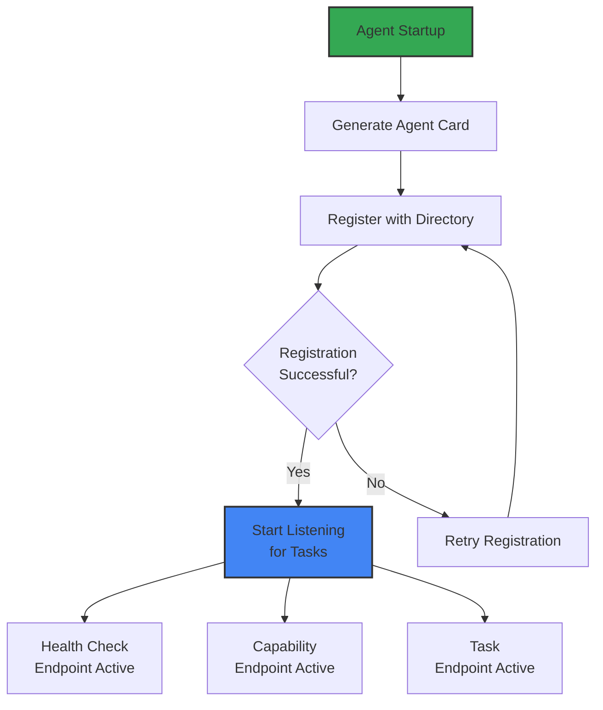

## A2A vs MCP

### Complementary Protocols

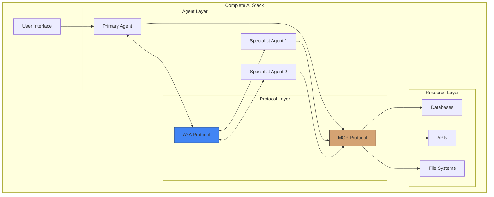

### When to Use Each

| Use Case | A2A | MCP | Both |
|----------|-----|-----|------|
| Multi-agent orchestration | ✓ | | |
| Database access | | ✓ | |
| Agent marketplace | ✓ | | |
| Tool standardization | | ✓ | |
| Complex enterprise workflows | | | ✓ |
| Cross-platform agent communication | ✓ | | |
| Resource management | | ✓ | |
| Collaborative AI systems | | | ✓ |

## Real-World Applications

### 1. Enterprise Workflow Automation

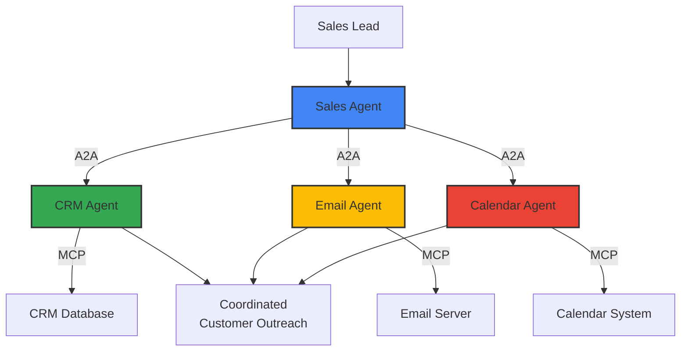

### 2. Multi-Modal Customer Service

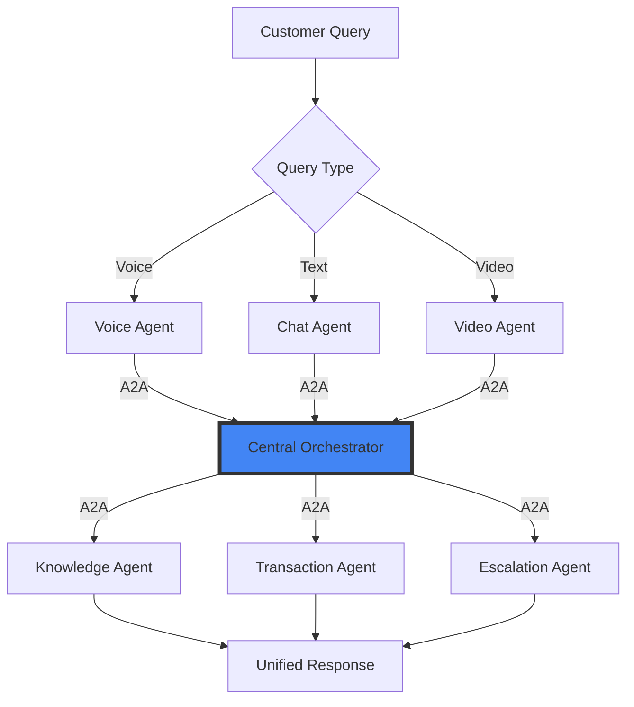

### 3. Collaborative Research System

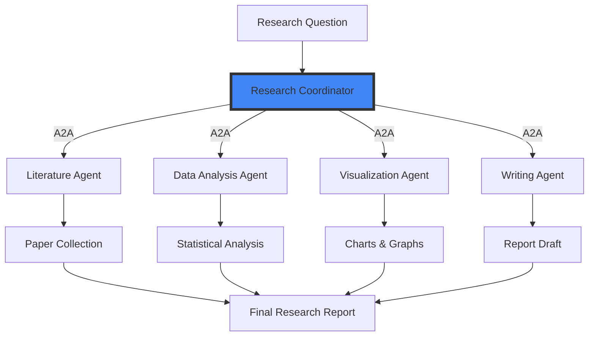

## Future of Agent Ecosystems

### The Agent Marketplace

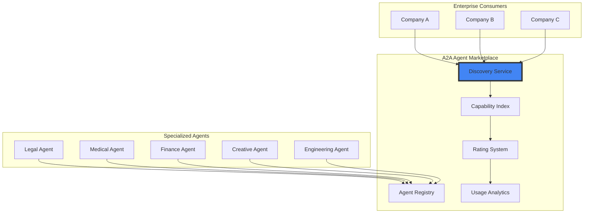

### Evolution Timeline

```mermaid
graph LR
    A[2024: MCP Launch] --> B[2025: A2A Launch]
    B --> C[2025-2026:<br/>Early Adoption]
    C --> D[2026-2027:<br/>Ecosystem Growth]
    D --> E[2027+:<br/>Ubiquitous AI Agents]
    
    F[Isolated AI Tools] --> G[Connected Tools<br/>(MCP)]
    G --> H[Collaborative Agents<br/>(A2A)]
    H --> I[Agent Economy]
    I --> J[AI-First Enterprises]
    
    style B fill:#4285f4,stroke:#333,stroke-width:2px
    style E fill:#34a853,stroke:#333,stroke-width:2px
```

## Best Practices

### 1. Agent Design Principles

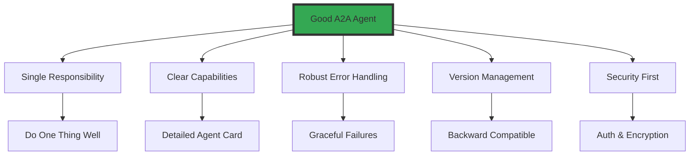

### 2. Security Considerations

- **Authentication**: Every agent must authenticate before communication
- **Authorization**: Implement fine-grained permissions for capabilities
- **Encryption**: All A2A messages should be encrypted in transit
- **Audit Trail**: Log all agent interactions for compliance

### 3. Performance Optimization

- **Caching**: Cache agent cards to reduce discovery overhead
- **Connection Pooling**: Reuse connections between frequently communicating agents
- **Async Operations**: Use streaming for long-running tasks
- **Load Balancing**: Distribute requests across multiple instances

## Conclusion

Google's A2A Protocol represents a fundamental shift in how we think about AI systems:

- **From Isolated to Connected**: Agents can now work together seamlessly
- **From Proprietary to Open**: Any framework can participate in the ecosystem
- **From Tools to Collaborators**: AI agents become true digital coworkers

Combined with Anthropic's MCP for tool access, A2A completes the infrastructure needed for a new generation of AI applications where specialized agents collaborate to solve complex problems. The protocol's support from 50+ major technology companies signals the industry's commitment to creating an interoperable AI future.

As A2A adoption grows, we can expect to see:
- 🌐 **Global agent marketplaces**
- 🤝 **Cross-company agent collaboration**
- 🚀 **Exponential growth in AI capabilities**
- 🏢 **True AI-first enterprises**

The age of collaborative AI has begun.