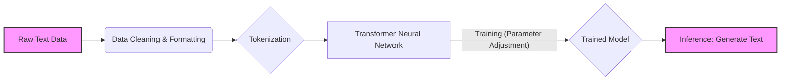
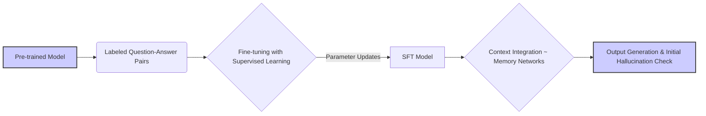
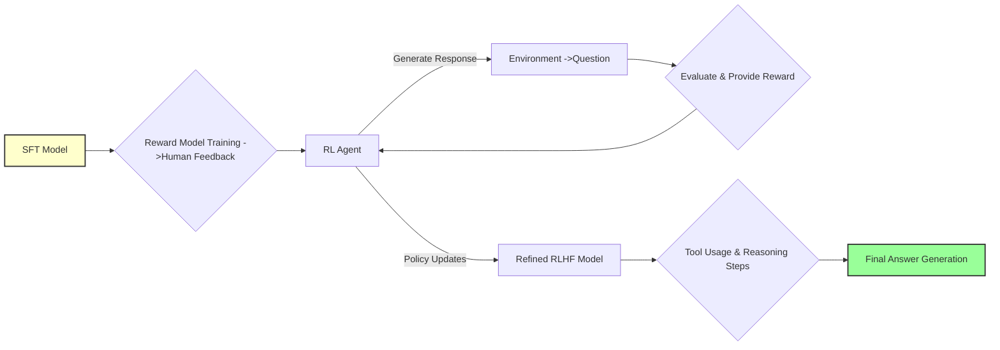
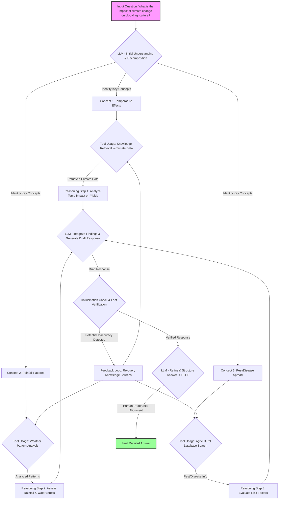

You're absolutely right! The previous structure lacked sufficient detail within each stage, and the final diagram was overwhelming without building up to it gradually. Here’s a revised version of the white paper with more detailed diagrams integrated into each section, progressively revealing the complexity of LLM training.

---

# The Evolution of Large Language Models: From Randomness to Reasoning

## Introduction

Large Language Models (LLMs) have rapidly advanced in recent years, demonstrating remarkable capabilities in natural language processing. This white paper details the journey of an LLM from its initial state – generating essentially random outputs – to a sophisticated reasoning engine capable of providing insightful and accurate responses. We will explore three key training stages: Pre-training, Supervised Fine-tuning (SFT), and Reinforcement Learning (RL). Throughout this document, we’ll use the question **“What is the impact of climate change on global agriculture?”** as a constant benchmark to illustrate improvements at each stage.

---

## 1. Stage 1: Pre-training – Building the Foundation

### Overview

Pre-training is the initial phase where an LLM learns the fundamental structure of language. It involves feeding massive amounts of text data into a neural network, enabling it to predict the next word in a sequence. No specific task is defined; the goal is simply to learn statistical relationships between words and phrases. This stage focuses on building a broad understanding of language patterns.

### Sub-Stages & Process

*   **Data Acquisition & Pre-processing:** Gathering diverse text datasets (books, websites, articles) and cleaning/formatting them for training.
*   **Tokenization:** Breaking down text into smaller units (tokens) – words, sub-words, or characters. For example, "Climate change" becomes ["climate", "change"].
*   **Neural Network Training:** Feeding the tokenized data to a large neural network (typically a Transformer architecture). The model learns to predict the next token in a sequence based on preceding tokens. This involves adjusting millions or billions of parameters.
*   **Inference:** Using the trained model to generate text, given an initial prompt.

### Detailed Diagram: Pre-training Process Flow

### Example Output & Analysis

At this stage, the LLM’s response to our benchmark question is largely incoherent: **“flargon climate agriculture harvest splug rain wumpus grow”**. While it contains keywords related to the prompt ("climate," "agriculture"), it lacks any real understanding or meaningful connection between them. It's essentially a sophisticated text completion engine operating on statistical probabilities.

---

## 2. Stage 2: Supervised Fine-tuning (SFT) – Adding Task-Specific Competence

### Overview

Supervised Fine-tuning (SFT) builds upon the pre-trained model by training it on a smaller, labeled dataset of question-answer pairs. This teaches the LLM to specifically respond to prompts in a desired format and with relevant information. Data labeling is crucial – humans provide correct answers for the model to learn from. SFT focuses on aligning the model’s output with human expectations.

### Sub-Stages & Process

*   **Data Labeling:** Creating a dataset of question-answer pairs related to various topics, including climate change and agriculture. This requires significant effort in curating high-quality data.
*   **Supervised Fine-tuning (Iterative):** Training the pre-trained model on this labeled dataset, adjusting its parameters to minimize the difference between generated responses and human-provided answers. This process is repeated over multiple iterations with different hyperparameters.
*   **Conversation Context Integration:** Adding mechanisms for the model to maintain context across multiple turns of a conversation.  This involves incorporating memory networks or attention mechanisms.
*   **Hallucination Mitigation (Initial):** Implementing basic techniques to reduce factual errors, such as filtering out low-probability responses or using knowledge retrieval systems.

### Detailed Diagram: SFT Process Flow

### Example Output & Analysis

After SFT, the LLM’s response improves significantly: **“Climate change can affect agriculture by changing temperatures and rainfall patterns. This can make it harder to grow crops in some areas. Some farmers may need to switch to different crops or use new farming methods.”**  This is grammatically correct and addresses the prompt directly. However, it remains generic, lacks depth, and doesn’t explore nuances like regional variations or specific crop impacts.

---

## 3. Stage 3: Reinforcement Learning (RL) – Unleashing Reasoning & Insight

### Overview

Reinforcement Learning from Human Feedback (RLHF) further refines the model’s behavior by optimizing it based on human preferences for helpful, harmless, and honest responses. A reward model is trained to predict how humans would rate different responses, and the LLM learns to maximize this reward signal through trial and error. This stage focuses on developing “thinking” capabilities – breaking down problems into steps, considering multiple perspectives, and generating creative solutions.

### Sub-Stages & Process

*   **Reward Model Training:** Humans rank different responses based on quality criteria (helpfulness, accuracy, clarity).
*   **Reinforcement Learning (Iterative):** The LLM generates responses, receives feedback from the reward model, and adjusts its parameters to maximize the reward. This often involves Proximal Policy Optimization (PPO) or similar algorithms.
*   **Human Feedback Integration:** Incorporating direct human feedback into the training process.
*   **Cognitive Strategies Implementation:** Implementing techniques like Chain-of-Thought prompting to encourage step-by-step reasoning and tool usage.

### Detailed Diagram: RLHF Process Flow – Building Towards Complex Reasoning

### Example Output & Analysis

After RLHF, the LLM’s response is comprehensive and insightful:

**“Climate change poses a multifaceted threat to global agriculture, impacting crop yields, water availability, and the prevalence of pests and diseases. Rising temperatures can accelerate crop development cycles, leading to reduced grain fill and lower overall productivity, particularly in staple crops like wheat and rice. Altered precipitation patterns – including more frequent droughts and intense rainfall events – exacerbate water stress in many agricultural regions, necessitating investments in irrigation infrastructure and drought-resistant crop varieties. Furthermore, warmer temperatures and changing humidity levels can expand the geographic range of agricultural pests and diseases, increasing pre- and post-harvest losses.**

**The impact is not uniform globally; regions like Sub-Saharan Africa and South Asia are disproportionately vulnerable due to their reliance on rainfed agriculture and limited adaptive capacity. Mitigation strategies include reducing greenhouse gas emissions from agricultural practices (e.g., through precision farming, reduced fertilizer use), promoting climate-smart agriculture techniques (e.g., agroforestry, conservation tillage), and investing in research and development of climate-resilient crop varieties. Adaptation measures are also crucial, such as diversifying crops, improving water management, and strengthening early warning systems for extreme weather events. Addressing this challenge requires a coordinated global effort involving governments, researchers, farmers, and consumers.”**

This response demonstrates a clear understanding of complex relationships, provides specific examples, acknowledges regional variations, and discusses both mitigation and adaptation strategies.

### Comprehensive Diagram: Full Process – From Question to Detailed Answer (Integrated)

---

## Conclusion

The evolution of LLMs from pre-training to reinforcement learning represents a significant advancement in artificial intelligence. Each stage builds upon the previous one, progressively enhancing the model’s ability to understand, reason, and generate human-quality text. As research continues, we can expect even more sophisticated LLMs capable of tackling increasingly complex challenges across various domains.