# MCP (Model Context Protocol): Universal Tool Integration for AI

## Overview

Model Context Protocol (MCP) is an open protocol that standardizes how AI assistants connect to external data sources and tools. Think of it as "USB for AI" - a universal standard that lets any AI system work with any tool or data source.

## Table of Contents
1. [What is MCP?](#what-is-mcp)
2. [Architecture Overview](#architecture-overview)
3. [Core Concepts](#core-concepts)
4. [MCP vs Traditional Integrations](#mcp-vs-traditional-integrations)
5. [Available MCP Servers](#available-mcp-servers)
6. [Building with MCP](#building-with-mcp)
7. [Real-World Examples](#real-world-examples)
8. [Best Practices](#best-practices)

## What is MCP?

MCP is a protocol that enables AI systems to:
- 🔌 **Connect** to any data source or tool through a standardized interface
- 🔄 **Interact** bidirectionally with external systems
- 🛡️ **Maintain** security boundaries between AI and external resources
- 📊 **Scale** integrations without modifying the AI system itself

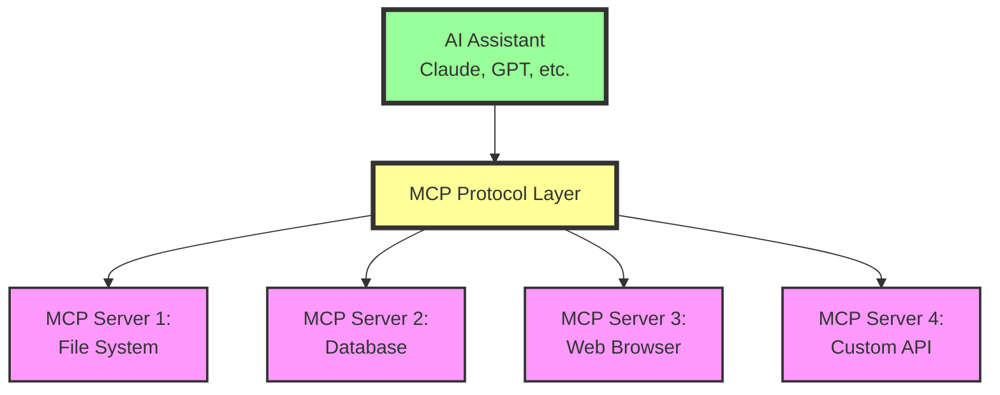
```mermaid
graph TD
    A[AI Assistant<br/>Claude, GPT, etc.] --> B[MCP Protocol Layer]
    B --> C[MCP Server 1:<br/>File System]
    B --> D[MCP Server 2:<br/>Database]
    B --> E[MCP Server 3:<br/>Web Browser]
    B --> F[MCP Server 4:<br/>Custom API]
    
    style A fill:#9f9,stroke:#333,stroke-width:4px
    style B fill:#ff9,stroke:#333,stroke-width:4px
    style C fill:#f9f,stroke:#333,stroke-width:2px
    style D fill:#f9f,stroke:#333,stroke-width:2px
    style E fill:#f9f,stroke:#333,stroke-width:2px
    style F fill:#f9f,stroke:#333,stroke-width:2px
```

## Architecture Overview

### The MCP Stack

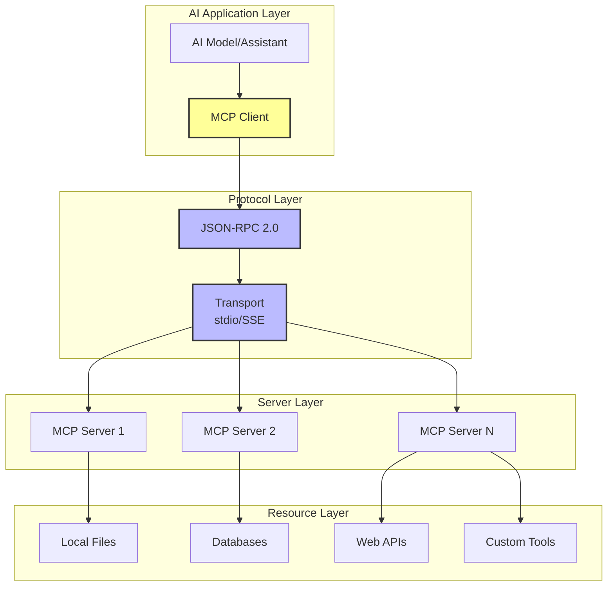
```mermaid
graph TD
    subgraph "AI Application Layer"
        A[AI Model/Assistant]
        B[MCP Client]
    end
    
    subgraph "Protocol Layer"
        C[JSON-RPC 2.0]
        D[Transport<br/>stdio/SSE]
    end
    
    subgraph "Server Layer"
        E[MCP Server 1]
        F[MCP Server 2]
        G[MCP Server N]
    end
    
    subgraph "Resource Layer"
        H[Local Files]
        I[Databases]
        J[Web APIs]
        K[Custom Tools]
    end
    
    A --> B
    B --> C
    C --> D
    D --> E
    D --> F
    D --> G
    E --> H
    F --> I
    G --> J
    G --> K
    
    style B fill:#ff9,stroke:#333,stroke-width:2px
    style C fill:#bbf,stroke:#333,stroke-width:2px
    style D fill:#bbf,stroke:#333,stroke-width:2px
```

### Communication Flow

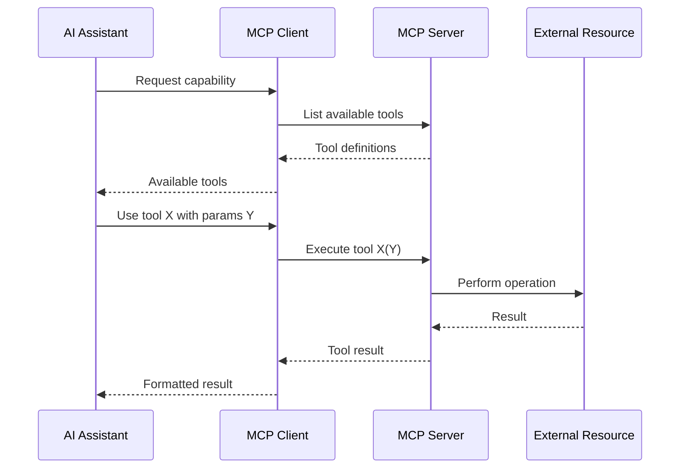
```mermaid
sequenceDiagram
    participant AI as AI Assistant
    participant Client as MCP Client
    participant Server as MCP Server
    participant Resource as External Resource
    
    AI->>Client: Request capability
    Client->>Server: List available tools
    Server-->>Client: Tool definitions
    Client-->>AI: Available tools
    
    AI->>Client: Use tool X with params Y
    Client->>Server: Execute tool X(Y)
    Server->>Resource: Perform operation
    Resource-->>Server: Result
    Server-->>Client: Tool result
    Client-->>AI: Formatted result
```

## Core Concepts

### 1. Resources
Data or functionality exposed by MCP servers.

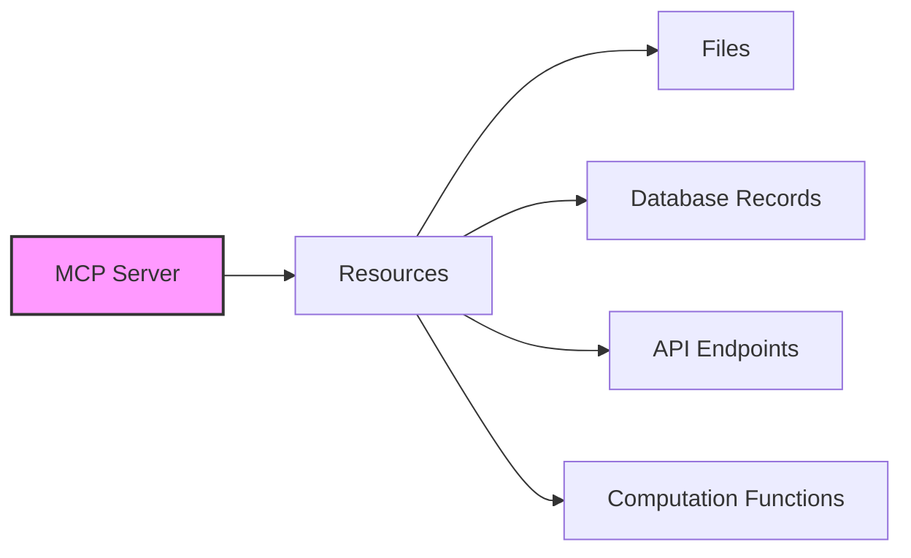
```mermaid
graph LR
    A[MCP Server] --> B[Resources]
    B --> C[Files]
    B --> D[Database Records]
    B --> E[API Endpoints]
    B --> F[Computation Functions]
    
    style A fill:#f9f,stroke:#333,stroke-width:2px
```

**Example Resource Types:**
- **Static**: Files, database records, configuration
- **Dynamic**: Live data feeds, API responses
- **Computational**: Functions, algorithms, tools

### 2. Tools
Actions that can be performed via MCP.

```python
# Example tool definition
{
    "name": "search_database",
    "description": "Search customer database",
    "parameters": {
        "query": "string",
        "limit": "integer"
    }
}
```

### 3. Prompts
Reusable prompt templates provided by servers.

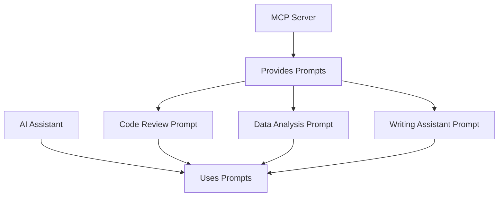
```mermaid
graph TD
    A[MCP Server] --> B[Provides Prompts]
    B --> C[Code Review Prompt]
    B --> D[Data Analysis Prompt]
    B --> E[Writing Assistant Prompt]
    
    F[AI Assistant] --> G[Uses Prompts]
    C --> G
    D --> G
    E --> G
```

### 4. Sampling
Server-initiated AI completions for enhanced workflows.

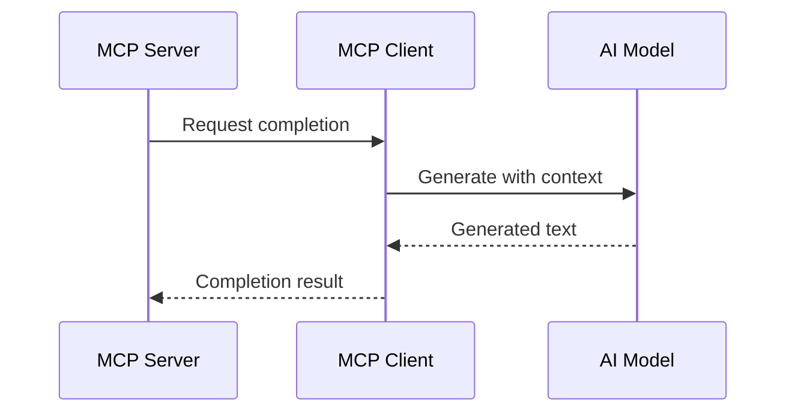
```mermaid
sequenceDiagram
    participant S as MCP Server
    participant C as MCP Client
    participant AI as AI Model
    
    S->>C: Request completion
    C->>AI: Generate with context
    AI-->>C: Generated text
    C-->>S: Completion result
```

## MCP vs Traditional Integrations

### Traditional Integration Challenges

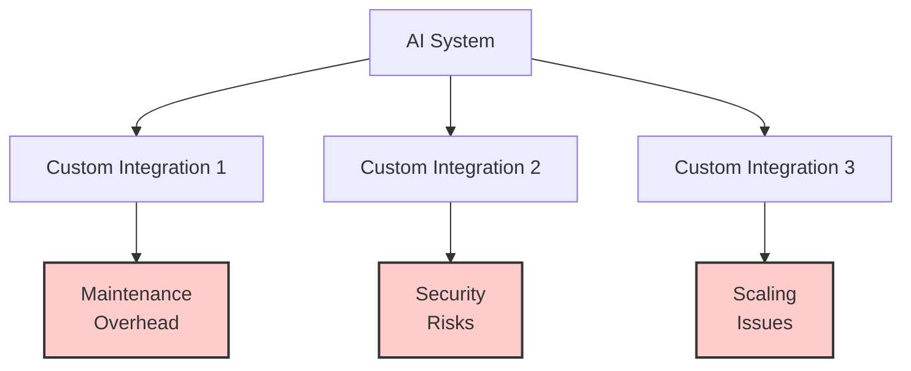
```mermaid
graph TD
    A[AI System] --> B[Custom Integration 1]
    A --> C[Custom Integration 2]
    A --> D[Custom Integration 3]
    
    B --> E[Maintenance<br/>Overhead]
    C --> F[Security<br/>Risks]
    D --> G[Scaling<br/>Issues]
    
    style E fill:#fcc,stroke:#333,stroke-width:2px
    style F fill:#fcc,stroke:#333,stroke-width:2px
    style G fill:#fcc,stroke:#333,stroke-width:2px
```

### MCP Solution

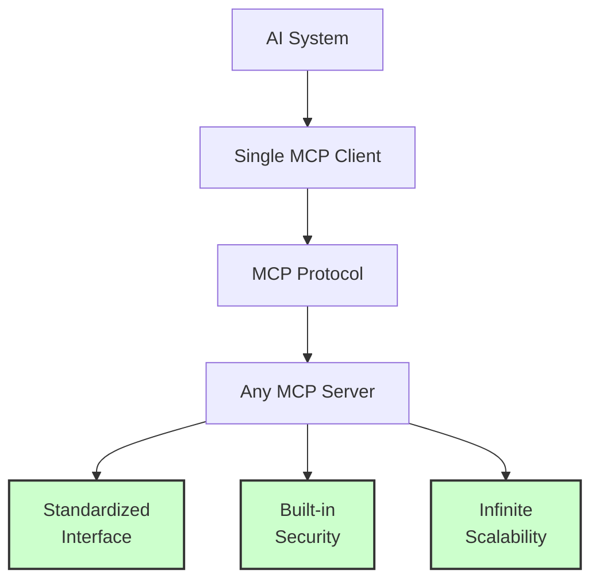
```mermaid
graph TD
    A[AI System] --> B[Single MCP Client]
    B --> C[MCP Protocol]
    C --> D[Any MCP Server]
    
    D --> E[Standardized<br/>Interface]
    D --> F[Built-in<br/>Security]
    D --> G[Infinite<br/>Scalability]
    
    style E fill:#cfc,stroke:#333,stroke-width:2px
    style F fill:#cfc,stroke:#333,stroke-width:2px
    style G fill:#cfc,stroke:#333,stroke-width:2px
```

### Comparison Table

| Aspect | Traditional Integration | MCP |
|--------|------------------------|-----|
| **Setup Complexity** | High - custom for each tool | Low - standardized protocol |
| **Maintenance** | Per-integration updates | Protocol-level updates |
| **Security** | Variable, often weak | Standardized security model |
| **Reusability** | Low - tied to specific AI | High - works with any MCP client |
| **Tool Discovery** | Manual documentation | Automatic via protocol |
| **Error Handling** | Inconsistent | Standardized |

## Available MCP Servers

### Official Servers

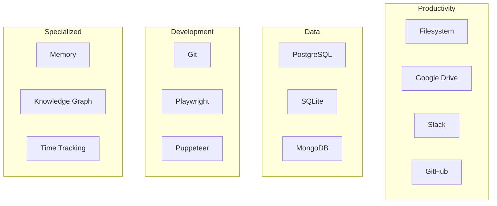
```mermaid
graph TD
    subgraph "Productivity"
        A[Filesystem]
        B[Google Drive]
        C[Slack]
        D[GitHub]
    end
    
    subgraph "Data"
        E[PostgreSQL]
        F[SQLite]
        G[MongoDB]
    end
    
    subgraph "Development"
        H[Git]
        I[Playwright]
        J[Puppeteer]
    end
    
    subgraph "Specialized"
        K[Memory]
        L[Knowledge Graph]
        M[Time Tracking]
    end
```

### Popular MCP Servers

1. **Filesystem** - Read/write local files
   ```bash
   npm install @modelcontextprotocol/server-filesystem
   ```

2. **PostgreSQL** - Database operations
   ```bash
   npm install @modelcontextprotocol/server-postgres
   ```

3. **Playwright** - Browser automation
   ```bash
   npm install @modelcontextprotocol/server-playwright
   ```

4. **Memory** - Persistent memory for AI
   ```bash
   npm install @modelcontextprotocol/server-memory
   ```

## Building with MCP

### Creating an MCP Server

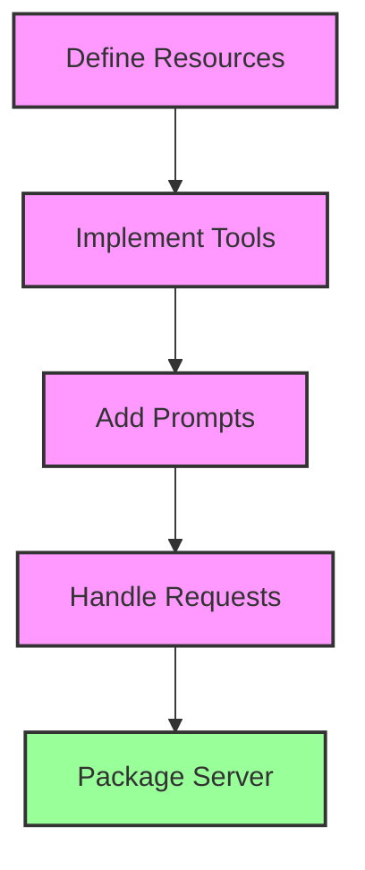
```mermaid
graph TD
    A[Define Resources] --> B[Implement Tools]
    B --> C[Add Prompts]
    C --> D[Handle Requests]
    D --> E[Package Server]
    
    style A fill:#f9f,stroke:#333,stroke-width:2px
    style B fill:#f9f,stroke:#333,stroke-width:2px
    style C fill:#f9f,stroke:#333,stroke-width:2px
    style D fill:#f9f,stroke:#333,stroke-width:2px
    style E fill:#9f9,stroke:#333,stroke-width:2px
```

**Basic Server Structure:**

```python
from mcp import Server, Tool, Resource

class MyMCPServer(Server):
    def __init__(self):
        super().__init__("my-server")
        
    @Tool("search_data")
    def search_data(self, query: str, limit: int = 10):
        """Search through data with query"""
        # Implementation
        return results
    
    @Resource("config")
    def get_config(self):
        """Provide configuration data"""
        return self.config_data
```

### Integrating MCP in Your Application


```mermaid
graph LR
    A[Your App] --> B[Initialize MCP Client]
    B --> C[Discover Servers]
    C --> D[Connect to Servers]
    D --> E[Use Tools/Resources]
    
    style B fill:#ff9,stroke:#333,stroke-width:2px
    style D fill:#ff9,stroke:#333,stroke-width:2px
```

**Client Integration Example:**

```python
from mcp import Client

# Initialize client
client = Client()

# Connect to server
await client.connect("postgresql-server")

# List available tools
tools = await client.list_tools()

# Use a tool
result = await client.call_tool(
    "query_database",
    {"sql": "SELECT * FROM users LIMIT 10"}
)
```

## Real-World Examples

### Example 1: Customer Support Agent with MCP

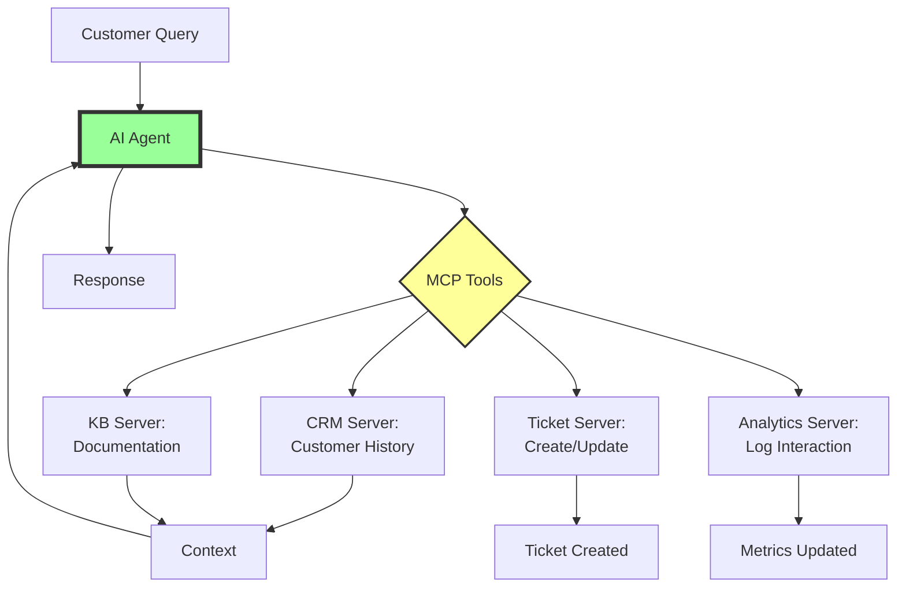
```mermaid
graph TD
    A[Customer Query] --> B[AI Agent]
    B --> C{MCP Tools}
    
    C --> D[CRM Server:<br/>Customer History]
    C --> E[KB Server:<br/>Documentation]
    C --> F[Ticket Server:<br/>Create/Update]
    C --> G[Analytics Server:<br/>Log Interaction]
    
    D --> H[Context]
    E --> H
    H --> B
    B --> I[Response]
    F --> J[Ticket Created]
    G --> K[Metrics Updated]
    
    style B fill:#9f9,stroke:#333,stroke-width:4px
    style C fill:#ff9,stroke:#333,stroke-width:2px
```

### Example 2: Code Analysis Pipeline

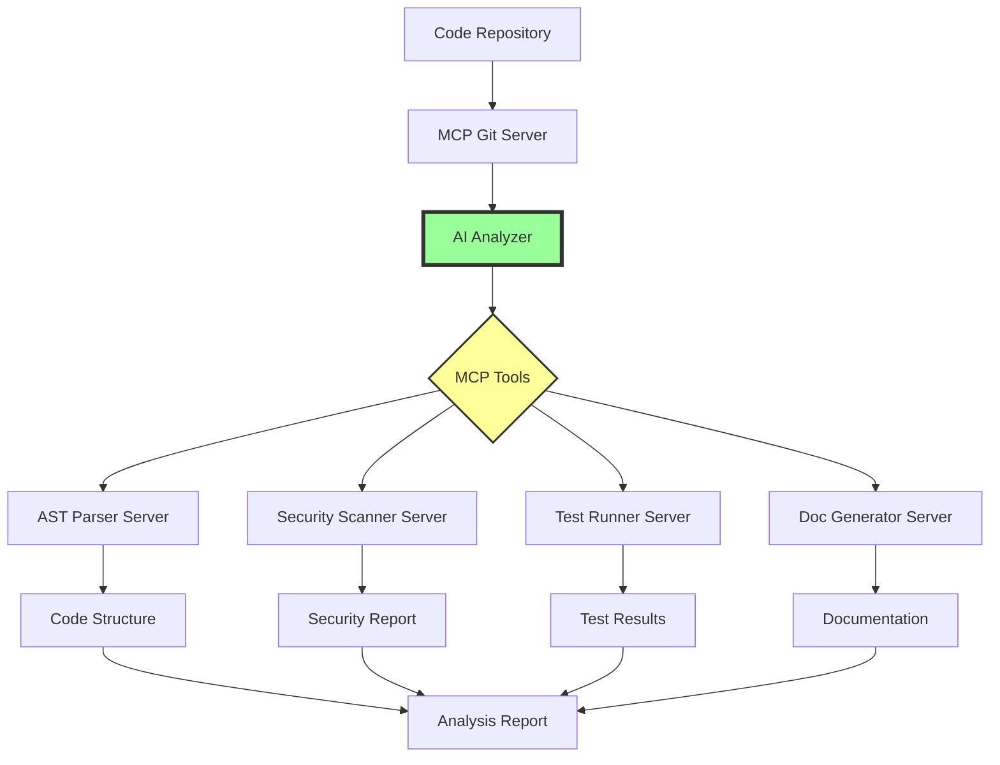
```mermaid
graph TD
    A[Code Repository] --> B[MCP Git Server]
    B --> C[AI Analyzer]
    
    C --> D{MCP Tools}
    D --> E[AST Parser Server]
    D --> F[Security Scanner Server]
    D --> G[Test Runner Server]
    D --> H[Doc Generator Server]
    
    E --> I[Code Structure]
    F --> J[Security Report]
    G --> K[Test Results]
    H --> L[Documentation]
    
    I --> M[Analysis Report]
    J --> M
    K --> M
    L --> M
    
    style C fill:#9f9,stroke:#333,stroke-width:4px
    style D fill:#ff9,stroke:#333,stroke-width:2px
```

### Example 3: Research Assistant

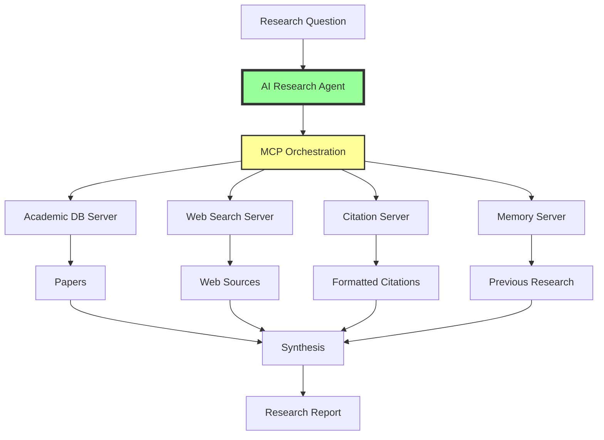
```mermaid
graph TD
    A[Research Question] --> B[AI Research Agent]
    
    B --> C[MCP Orchestration]
    C --> D[Academic DB Server]
    C --> E[Web Search Server]
    C --> F[Citation Server]
    C --> G[Memory Server]
    
    D --> H[Papers]
    E --> I[Web Sources]
    F --> J[Formatted Citations]
    G --> K[Previous Research]
    
    H --> L[Synthesis]
    I --> L
    J --> L
    K --> L
    
    L --> M[Research Report]
    
    style B fill:#9f9,stroke:#333,stroke-width:4px
    style C fill:#ff9,stroke:#333,stroke-width:2px
```

## Best Practices

### 1. Server Design

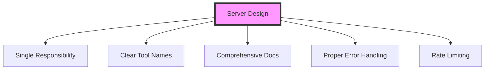
```mermaid
graph TD
    A[Server Design] --> B[Single Responsibility]
    A --> C[Clear Tool Names]
    A --> D[Comprehensive Docs]
    A --> E[Proper Error Handling]
    A --> F[Rate Limiting]
    
    style A fill:#f9f,stroke:#333,stroke-width:4px
```

**Guidelines:**
- One server = one domain (e.g., database, filesystem, API)
- Tool names should be self-descriptive
- Always include parameter descriptions
- Return structured, predictable responses

### 2. Security Considerations

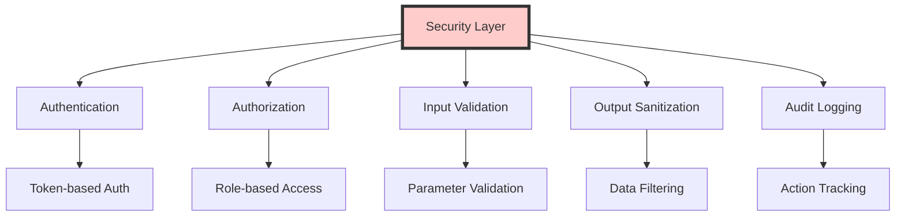
```mermaid
graph TD
    A[Security Layer] --> B[Authentication]
    A --> C[Authorization]
    A --> D[Input Validation]
    A --> E[Output Sanitization]
    A --> F[Audit Logging]
    
    B --> G[Token-based Auth]
    C --> H[Role-based Access]
    D --> I[Parameter Validation]
    E --> J[Data Filtering]
    F --> K[Action Tracking]
    
    style A fill:#fcc,stroke:#333,stroke-width:4px
```

### 3. Performance Optimization

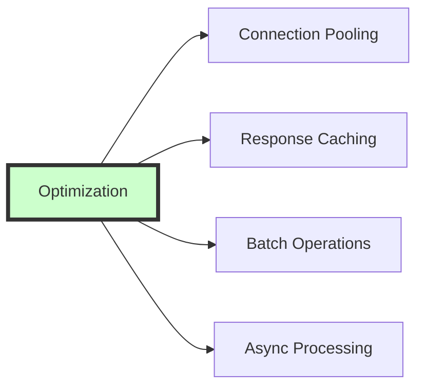
```mermaid
graph LR
    A[Optimization] --> B[Connection Pooling]
    A --> C[Response Caching]
    A --> D[Batch Operations]
    A --> E[Async Processing]
    
    style A fill:#cfc,stroke:#333,stroke-width:4px
```

### 4. Error Handling

```python
class RobustMCPServer:
    def handle_error(self, error):
        return {
            "error": {
                "type": error.__class__.__name__,
                "message": str(error),
                "recoverable": self.is_recoverable(error)
            }
        }
```

## Advanced Patterns

### 1. Server Composition

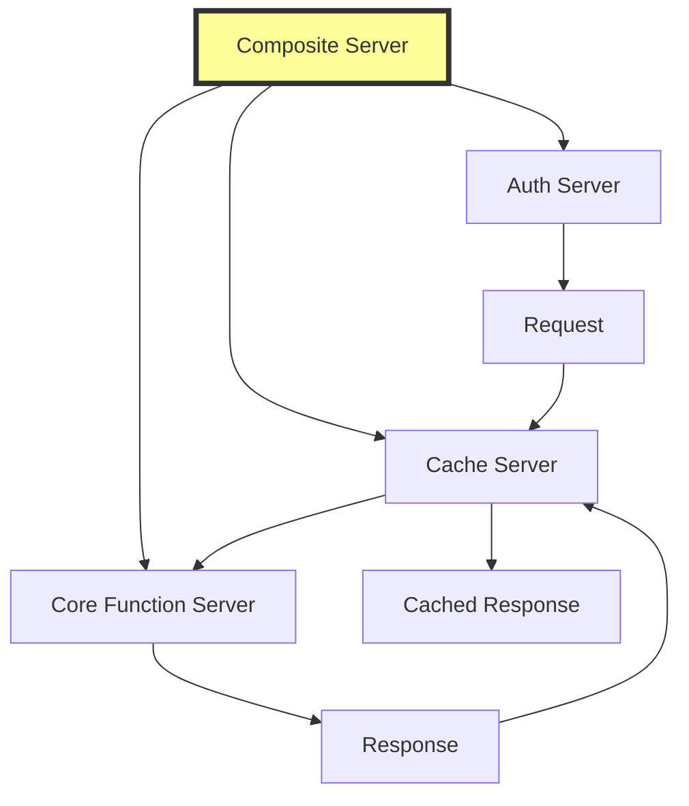
```mermaid
graph TD
    A[Composite Server] --> B[Auth Server]
    A --> C[Cache Server]
    A --> D[Core Function Server]
    
    B --> E[Request]
    E --> C
    C --> D
    D --> F[Response]
    F --> C
    C --> G[Cached Response]
    
    style A fill:#ff9,stroke:#333,stroke-width:4px
```

### 2. Dynamic Tool Registration

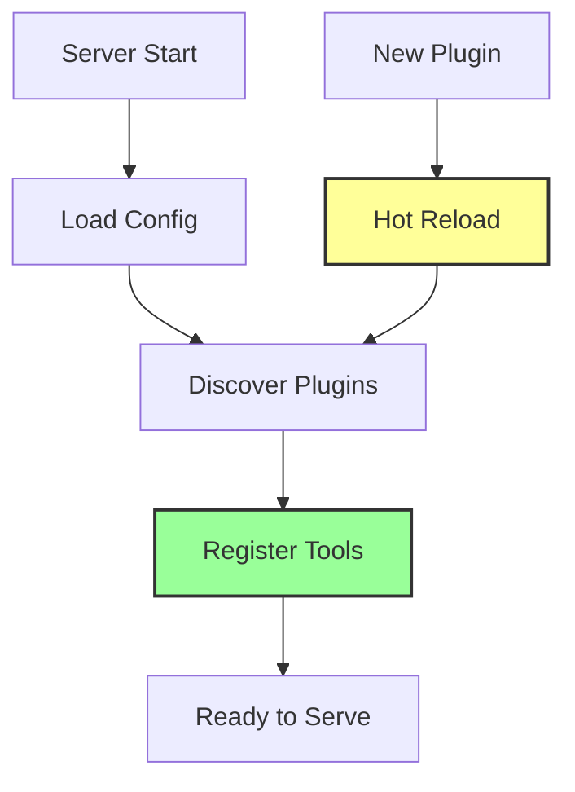
```mermaid
graph TD
    A[Server Start] --> B[Load Config]
    B --> C[Discover Plugins]
    C --> D[Register Tools]
    D --> E[Ready to Serve]
    
    F[New Plugin] --> G[Hot Reload]
    G --> C
    
    style D fill:#9f9,stroke:#333,stroke-width:2px
    style G fill:#ff9,stroke:#333,stroke-width:2px
```

### 3. Multi-Server Coordination

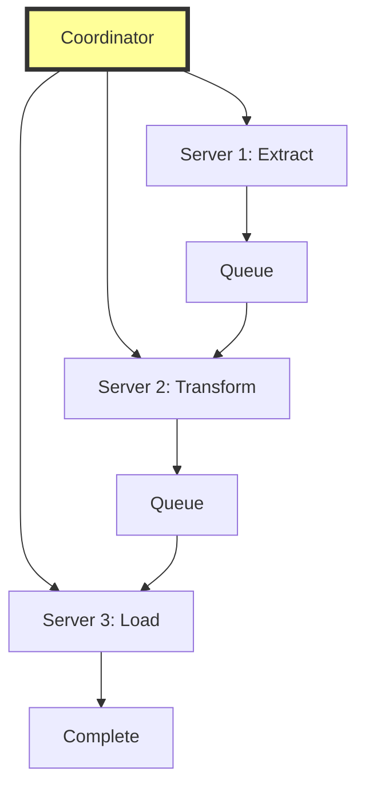
```mermaid
graph TD
    A[Coordinator] --> B[Server 1: Extract]
    A --> C[Server 2: Transform]
    A --> D[Server 3: Load]
    
    B --> E[Queue]
    E --> C
    C --> F[Queue]
    F --> D
    
    D --> G[Complete]
    
    style A fill:#ff9,stroke:#333,stroke-width:4px
```

## Future of MCP

### Emerging Capabilities

```mermaid
graph TD
    A[MCP Future] --> B[Streaming Support]
    A --> C[Binary Data]
    A --> D[P2P Communication]
    A --> E[Federated Servers]
    A --> F[AI-to-AI Protocol]
    
    style A fill:#9f9,stroke:#333,stroke-width:4px
```

### Ecosystem Growth

1. **Standardization** - Industry-wide adoption
2. **Marketplace** - MCP server marketplace
3. **Certification** - Security and quality standards
4. **Tooling** - Better development tools
5. **Integration** - Native OS and app support

## Getting Started

### Quick Start Guide

```mermaid
graph LR
    A[1. Install MCP CLI] --> B[2. Browse Servers]
    B --> C[3. Configure Client]
    C --> D[4. Connect & Use]
    
    style A fill:#f9f,stroke:#333,stroke-width:2px
    style D fill:#9f9,stroke:#333,stroke-width:2px
```

```bash
# Install MCP tools
npm install -g @modelcontextprotocol/cli

# List available servers
mcp list

# Install a server
mcp install filesystem

# Configure in your AI client
mcp configure filesystem
```

## Conclusion

MCP represents a paradigm shift in how AI systems interact with the world:

- 🔓 **Open Protocol** - Not locked to any vendor
- 🚀 **Scalable** - Add capabilities without changing AI
- 🛡️ **Secure** - Built-in security model
- 🤝 **Interoperable** - Any AI can use any MCP server

The future of AI isn't just about better models - it's about better connections to the world's data and tools. MCP makes that future possible today.